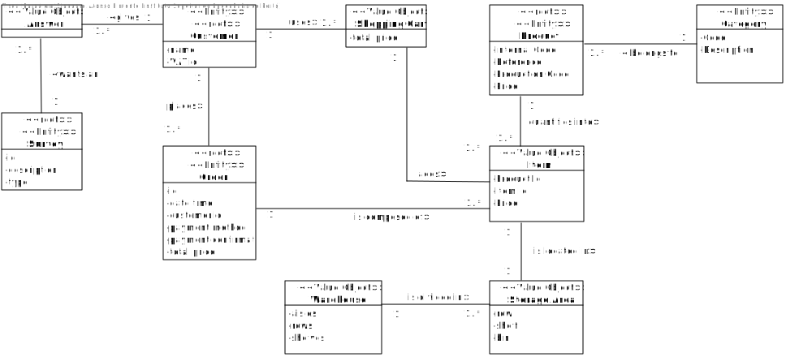

# USDemo1
=======================================

## Domain Model

In a first approach, we must analyze the business as a whole and then detail each part that requires detailing.

Considering the principles of Domain Driven Design, the identification of the Entities and Value Objects is a complicated task. In the Domain Model we must represent all of the Entities. The issue here is if we should also represent some Value Objects or not.

Given this, we can take a look at the approach we have had:

We must always try to have a perspective of an outsider when representing the business idea. 

The question that needs answering is
*Can we understand the business by looking and analyzing this domain model?* 

The answer is probably yes.

By oversimplifying what the Client requests, we can say:

* We want an app that allows customers to search a product catalog, select a given product and add it to a shopping cart.
* The customer can turn the selection in the shopping cart into an order.
* A product belongs to a category.
* Products are located in a storage area inside the warehouse.
* We want customers to answer surveys about certain products, those surveys must be thought in a generic way.

Some connections may not be clearly evident, for example the Shopping Cart allowing the Customer to turn the selection into an order.

Also, entities are elements that have an unique identification and are vital for the business flow.

Aggregates allow us to understand in more detail what surrounds and complements a certain Entity.

Lets start by the Customer Aggregate:

As we can see, the address is not represented in the domain model as it is not relevant.

Could there be certain attributes of the customer that can turn into a Value Object? Besides Addresses, we do not think so. We can change its name, we can change its email, etc. and he will still stay the same Customer, those are simple attributes.

The Product Aggregate is a bit more complex:

The client refers we must consider that a product can be authorized or not to be ordered. Hence the need for a Value Object named Order Authorization, even in terms of organization, it makes sense. 

The barcode is dependent of a Standard set, it is important that it is considered as a Value Object and not as a simple attribute due to the fact that it has this dependency, it can change.

The Description Value Object exists also due to an organizational sense. We could have the three types of Description (Short, Extended and Technical) as attributes of the Product, but if we consider that, when one of the descriptions is changed, the others will probably also be changed, it makes sense that we keep them joint in some way.

The biggest ambiguity, probably in the whole business, is the concept of Item.
The Item Value Object is not something stated directly by the Client to be necessary. The Client describes the business around the concept of Products, although it leaves the doubt that if a Product corresponds, lets say, to something that will have a quantity or if every Product will be unique, i.e. if a company sells Pens, and they have the Pen model XYZ with a stock of 1000, will the company have 1000 unique Products OR will they have 1000 items of that Model?

Basically, can we look at the Product entity as representing a Model or as an item of that Model?

In order to maybe simplify, we have considered that the existence of the Value Object Item is justified, it will also make the Concept of a Shopping Cart and of a Storage Area easier to grasp.

The only really big doubt here lies on if there is a need to join the Shopping Cart in this Aggregate or not.
We have opted to not represent it due to the fact that it might not be the only mean to "Create" an order.

The payment method could perhaps be considered a VO if the client had not mentioned that, for concept purposes, it will not be considered as something mutable.

The shipment method, as it will have an associated cost, is important enough to have its own "Definition".

Order Status, since it will change from phase to phase with different definitions, it should be a Value Object.

This is also a difficult concept to grasp. 
If an Entity is something unique with an id, and in this case, for conceptual purposes, we only have ONE warehouse, it does not make sense to make the Warehouse an Entity, we will not need to manage Warehouses.

We understand that even if the Definition of this Aggregate is irrational by the Principles of Domain Driven Design, by the perspective of the Client, it is need for him to understand the Concepts we are trying to expose.

Perhaps the AGVs could be promoted into an Entity, but there is no evident reason for it. We will not need to exactly manage AGVs. We will, although, need to assign them tasks later on, they will be responsible for collecting Items from different locations in the Warehouse so as to allow the Warehouse employees to prepare an Order and ship it.

The Client wants customers to answer surveys about products. But since he wants them to be generic, it does not make sense for us to show a connection between the survey itself and the Products entity. 

Each Survey has a set of rules it must follow, those rules, even if generic, could possibly be changed if wanted. 

Since the answers might be complex, they cannot be a simple attribute of the surveys. the Answer must come from a Customer, the survey is not created by the Customer, it is Answered by him.

Questions might also change over time, it might be important to have it as a Value Object and not just an attribute.

# Conclusion

The definition of what could become a Value Object and what could become a simple attribute or even what could become an Entity is very broad. 
We have to notion that some of these decisions will most likely be changed in the future in order to correspond to the client's needs and also give us a viable base for the project development. This is a phase we can not miss by much and if we do miss, we must correct it before we go further.