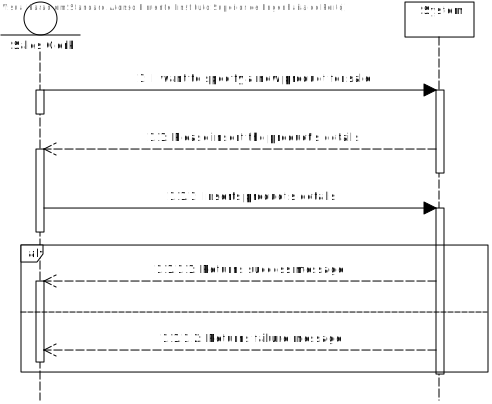
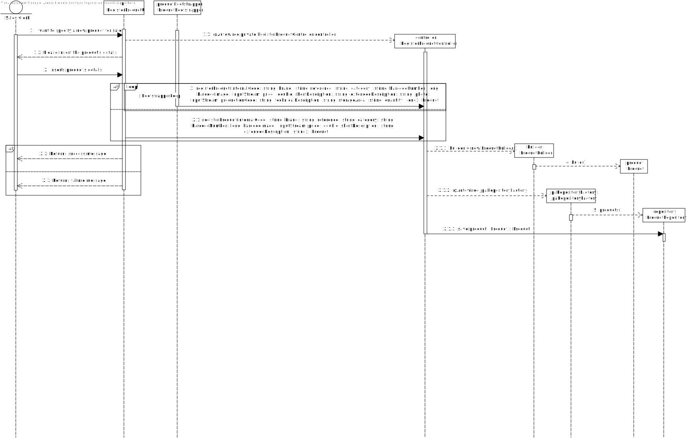
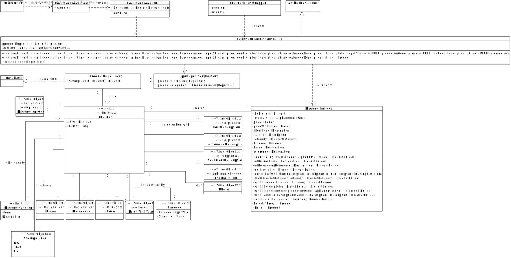

# US1001
=======================================

# 1. Requirements

**US1001** - As Sales Clerk, I want to specify a new product for sale.
___
Products basic information comprehends a unique internal code, a short and an extended description as well as a more technical description, a set of photos, a brand name and reference. Moreover, products can be organized by categories.
To foster integration with other information systems, a product also has (i) a mandatory barcode according to a valid coding standard, an optional production code, a price with and without taxes and availability.

Reference: [Specifications document section 2.1](https://moodle.isep.ipp.pt/pluginfile.php/201265/mod_resource/content/2/LEI-2021-22-Sem4-Project_v3-SystemDescription.pdf)
___
Mandatory attributes: internal code, short and extended description.

- photo: it might be of any common format (e.g. png, jpeg, svg);

- short description: not empty having 30 chars maximum;

- extended description: not empty with a minimum of 20 chars and 100 chars maximum;

- technical description: multiple lines of text, preferably with no limit or the biggest possible.

- brand: not empty having 50 chars maximum;

- reference: not empty alphanumeric code with at 23 chars maximum;

- production code: not empty alphanumeric code with at 23 chars maximum however it might meet a given regular expression defined/configured at deployment time.

- internal code: not empty alphanumeric code with at 23 chars maximum however it might meet a given regular expression defined/configured at deployment time.

Reference: [Forum Question](https://moodle.isep.ipp.pt/mod/forum/discuss.php?d=15529)
___
Product barcode follow universal standards as EAN13, UPC and so on. The purpose is to univocally identify a given product.

The production code is used for integration with other external systems, such as a manufacturing system.

The product barcode is the same for all units of a given product.

Reference: [Forum Question](https://moodle.isep.ipp.pt/mod/forum/discuss.php?d=15594)
___

Regarding product photos:

From a usability perspective, it would be better having a window (or any other way) to select the photo file to be uploaded.

However, if by some reason that option is not viable by now the user can write the path but the system must validate it.

Reference: [Forum Question](https://moodle.isep.ipp.pt/mod/forum/discuss.php?d=15900)
____

According to the requirements specified previously and also the context of the integrative project within EAPLI and LAPR4, the plan for the user story is the followning:

- Create a sub-menu within the main menu UI with the title "Register Product".
- Ask the user to insert an alphanumeric code for the new product internal code.
- Validate if the internal code provided by the user adheres to the business rules for the composition of the alphanumeric code.
- Ask the user to insert a brand.
- Validate if the brand provided by the user adheres to the business rules for the composition of the designation.
- Ask the user to insert a reference.
- Validate if the reference provided by the user adheres to the business rules for the composition of the designation.
- Ask the user to choose an existing product category.
- Ask the user to insert a price.
- Ask the user for a short description.
- Validate if the short description provided by the user adheres to the business rules for the composition of the short description.
- Ask the user for a long description.
- Validate if the long description provided by the user adheres to the business rules for the composition of the long description.
- Ask the user for a bar code.
- Ask the user for the barcode's image.
- Validate the barcode's according to the business rules.
- Validate if a product with the same internal code already exists.
- If the previous scenario does not occur, a new product should be created and a success message should be returned to the user.

# 2. Analysis
The analysis done for this user story was heavily influenced by the example project provided in the class of EAPLI. The example project can be found at this link: https://bitbucket.org/pag_isep/ecafeteria-base/src/master/

## User interaction
### Menu Layout
To make sure that the user was able to easily interact with the functionality to register a new product category and to establish the initial base menu for all potential user stories related to product, the planned approach consisted in creating a sub-menu within the main menu with the title **Product**. The sub-menu **Product** should also display all the available functionalities related to product in a drop-down list. 

### Error Handling
The expected failed scenarios for this user story are the following:
- Alphanumeric code does not adhere to the business rules for the alphanumeric code.
- Product descriptions which does not adhere to the business rules for the product descriptions.
- The barcode does not adhere to the business rules for the product's barcode.
- Product already registered with the same alphanumeric code specified by the user.

In all of the above-mentioned failed scenarios, a user-friendly message needs to be displayed and specifying exactly what caused the failure scenario.

## Domain concepts
According to the gathered requirements and also the user story specification, we could extract the following domain concepts:

### Entities
From the user story and the project specification, we can extract the logical consequence that the system/application should be able to manage multiple products and each product has its own unique identity hence on our system a Product entity needs to exist.

### Value Objects
According to the gathered requirements regarding the composition of the alphanumeric code, brand, reference, category, short description, long description, technical description, barcode, photos, storage location for each product, we can extract the logical consequence that two value objects should exist 

**Value Objects**: internalCode, brand, reference,
ProductCategory, Barcode, price, ShortDescription, LongDescription, productCode, TechnicalDescription,StorageArea, Photos

### Application Engineering
The developed code should follow an approach where there is a clear separation of concerns within the application and a clear division of responsibilities for each developed class, meaning, there should be a clear separation between the code that is meant to handle the User Interface, the code that is meant to handle the persistence of the product categories and also the code that is meant to make sure the business rules are applied properly. 
In order to adhere to the previous statement the approach taken consisted of employing the following layers for the developed code:

**Action Layer**: The action layer is responsible for initiating the action necessary to display the correct user interface to the user so that the user can register a new product.

**User Interface Layer**: The user interface layer is responsible for handling all the user inputs and all the interaction with the user.

**Controller Layer**: The controller layer is responsible for receiving the user input from the UI and performing the necessary operations that are needed to fulfill the user story.

**Persistence Layer**: The persistence layer is responsible for actually persisting the data that is meant to be persisted under the context of the user story.

**Domain Layer**: The domain layer is responsible for employing and enforcing all the business rules related to the product, e.g short description should not be empty and a maximum of 20 characters.

This layered approach helps to adhere to vital SOLID principles such as the Single Responsibility Principle and Open Closed Principle.

# 3. Design

## 3.1. Realization of Functionality
The following system sequence diagram displays the interaction between the user and the system:

**System Sequence Diagram**:

The following sequence diagram displays the interaction between all the developed components inherent to this user story:

**Sequence Diagram**:

## 3.2. Class Diagram
In order to make the different layers of the application loosely coupled a set of interfaces was defined to make sure that the dependencies between layers were upon abstractions and not actual concrete implementations. The defined interfaces were: RegisterProductController and ProductRepository. 

The RegisterProductController interface defines the contract fulfilled by the controller or the supported operations by the controller layer.

The ProductRepository interface defines the contract fulfilled by the repository or the supported operations by the persistence layer. 

According to what was described in the analysis section, an entity and twelve value objects were created. The Product class represents the domain entity, the class ProductCategory represents another entity and the classes AlphanumericalCode - internalCode, short, long and technicalDescription, Money - price, Money - priceWithTaxes, Designation - Reference, Designation - Brand and StorageArea - storageArea  represent the domain value objects.

## 3.3. Software Patterns

### Layered architecture
As alreayd mentioned on other sections of this document and also the previously displayed class diagram, a well thought out layered approach was followed for the development of this feature. Five layers were developed with concrete responsibilities in mind:

**Action Layer**: The action layer is responsible for initiating the action necessary to display the correct user interface to the user so that the user can register a new product category.

**User Interface Layer**: The user interface layer is responsible for handling all the user inputs and all the interaction with the user.

**Controller Layer**: The controller layer is responsible for receiving the user input from the UI and perform the necessary operations that are needed to fulfill the user story.

**Persistence Layer**: The persistence layer is responsible for actually persisting the data that is meant to be persisted under the context of the user story.

**Domain Layer**: The domain layer is responsible for employing and enforcing all the business rules related to the product, e.g short description should not be empty and a maximum of 20 characters.

### SOLID Principles
According to the class diagrams displayed and also the explanations provided in the Design section we can infer that the following SOLID principles were employed in the developed of this feature:

**Single Responsibility Principle**: Each developed class has a specific purpose attributed to it and a specific responsibility assigned to it. This can also be inferred from the very small set of methods provided by each class.

**Open/Closed Principle**: Each developed class can be further extended but cannot be modified as its behavior is strictly defined and well outlined.

**Interface Segregation Principle**: Each defined interface is really small in size and very specific which adheres to the principle of Interface Segregation from SOLID.

**Dependency Inversion Principle**: Dependencies between modules are bound by the abstractions created by the interfaces and not by actual concrete implementations, which adhere to the principle of dependency inversion from SOLID.

### Explicit dependencies
From the class diagram, one can infer that each class has a constructor explicitly defining the dependencies that the class needs in order to perform its operations which is considered to a good practice to follow since it makes it transparent to the consumer of the class which is the dependencies of the consumed class. 

The usage of explicit dependencies also helps with unit testing since it allows for "injected" mocked versions of the dependencies which can be manipulated and leveraged in order to create unit tests with the dependencies isolated from the class to be tested.

### Interfaces
One can infer from the class diagram that interfaces were defined and used during the development of this feature. The usage of these interfaces makes the codebase more coherent and promotes well-defined responsibilities. Interfaces were also used to make sure that the different modules of the developed code can depend upon abstractions and not actual concrete implementations. The usage of interfaces also made it easier and improved the created unit tests, since the usage of dependencies through interfaces allows the usage of mocks in order to isolate dependencies from the classes being tested.

### Immutability
One can infer from the class diagram that each developed class has a single constructor with all the required dependencies and no setters defined. This promotes immutability within the codebase which also helps to have concrete and predictable behavior in the code that was developed.

## 3.4. Tests 

### Regular Unit Tests

Unit tests were created to ensure basic integrity within the developed code. Example of a unit test to ensure a null check is performed on an explicit dependency of the RegisterProductController:

**Null check:** Validates if an exception is thrown when a null argument is passed

    @Test
    public void Invalid_NullProductRepository_ShouldThrowIllegalArgumentException(){
        //Act & Assert
        assertThrows(IllegalArgumentException.class, () -> new RegisterProductControllerImpl(null, mockListCategories, mockAuthorizationService));
    }
___

### Business Logic

Business logic tests were created to ensure that the intended business rules are ensured, for example:

**Empty alphanumeric code:** Validates if an empty alphanumeric code was sent.

    @Test
    public void Invalid_NullString_ShouldThrowIllegalArgumentException(){
        // Act & Assert
        assertThrows(IllegalArgumentException.class, () -> AlphaNumericCode.valueOf(null));
    }

**Maximum length on short description code exceeded:** Validates if the maximum length for the short description was exceeded.

    @Test
    public void Invalid_DescriptionExceedsMaximumLength_ShouldThrowIllegalArgumentException(){
        // Act & Assert
        assertThrows(IllegalArgumentException.class, () -> ShortDescription.valueOf("MAXIMUMLENGTHEXCEEEDBYALOTOFCHARACTERSAAAAAAAAAAAAAAAAAAAAAAAAAAAAAAAAAAAAAAAAAAAAAAAAAAAAAAAAAAAAAAAAAA"));
    }

**Minimum length on long description code exceeded:** Validates if the minimum length for the long description is reached.

    @Test
    public void Invalid_DescriptionDoesNotHaveMinimumLength_ShouldThrowIllegalArgumentException(){
        // Act & Assert
        assertThrows(IllegalArgumentException.class, () -> LongDescription.valueOf("MINLENGTH"));
    }

**Empty description:** Validates if an empty description was sent.

    @Test
    public void Invalid_EmptyString_ShouldThrowIllegalArgumentException(){
        // Act & Assert
        assertThrows(IllegalArgumentException.class, () -> ShortDescription.valueOf(""));
        assertThrows(IllegalArgumentException.class, () -> LongDescription.valueOf(""));
    }

### User Story

User story tests were created to ensure the basic functionality of the user story:

**Product already registered:** Validates if an exception is thrown when a product already exists with the specified alpha numeric code:

 	@Test
    public void Invalid_ExistentInternalCode_ShouldThrowIntegrityViolationException() throws IOException {
        //Arrange
        var internalCode = "1234A5678";
        {...}
        doNothing().when(mockAuthorizationService).ensureAuthenticatedUserHasAnyOf(any(Role.class));
        when(mockProductRepository.containsOfIdentity(any(AlphaNumericCode.class))).thenReturn(true);

        //Act & Assert
        assertThrows(IntegrityViolationException.class,() -> productController.registerProduct(internalCode,brand,reference,category,barcode,bars,price, shortDescription, extendedDescription));

        //Assert
        verify(mockAuthorizationService).ensureAuthenticatedUserHasAnyOf(any(Role.class));
        verify(mockProductRepository).containsOfIdentity(any(AlphaNumericCode.class));
    }

**Registration of a product:** Validates if the product is actually registed if valid data is sent:

    @Test
    public void Valid_NonExistentInternalCode_ShouldInsertNewProductAndNotThrowException() throws IOException {
        //Arrange
        var internalCode = "1234A5678";
		{...}

        doNothing().when(mockAuthorizationService).ensureAuthenticatedUserHasAnyOf(any(Role.class));
        when(mockProductRepository.containsOfIdentity(any(AlphaNumericCode.class))).thenReturn(false);

        //Act & Assert
        assertDoesNotThrow(() -> productController.registerProduct(internalCode,brand,reference,category,barcode,bars,price, shortDescription, extendedDescription));

        //Assert
        verify(mockAuthorizationService).ensureAuthenticatedUserHasAnyOf(any(Role.class));
        verify(mockProductRepository).containsOfIdentity(any(AlphaNumericCode.class));
        verify(mockProductRepository).save(any());
    }

# 4. Implementation

Implementation of the user story went according to the plan and the analysis described on this document.

## Commits

## Tasks

# 5. Integration/Demonstration

During the development of this feature, an effort has been made to make sure the developed code could be reused in other user stories for this sprint such as the user story US1001. To make sure that code was reusable, an effort was made to make sure the code was as much modular as possible so that different modules could be implemented in other stories, such as the ProductRepository module for example.

# 6. Observations
None

