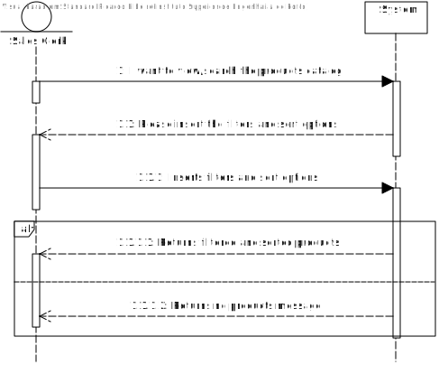
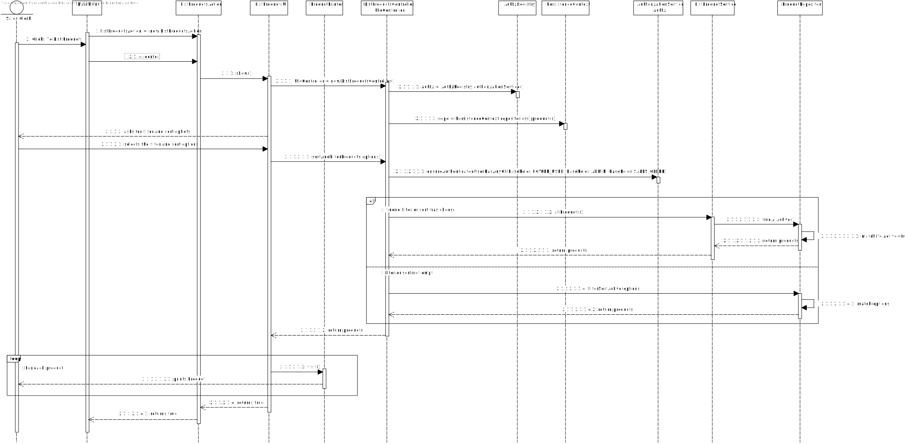
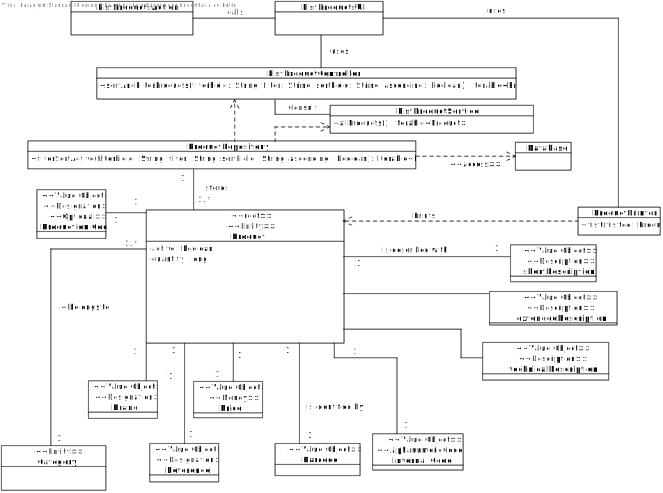
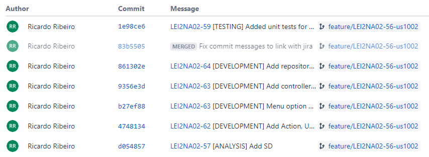
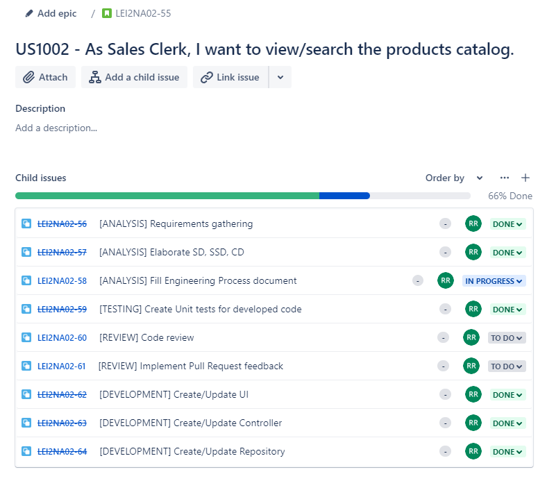

# US1002
=======================================

# 1. Requirements

**US1002** - As Sales Clerk, I want to view/search the products catalog.
___
Should be possible to filter and sort the products. 

Reference: [Forum Question](https://moodle.isep.ipp.pt/mod/forum/discuss.php?d=15690#p20221)
___

According to the requirements specified previously and also the context of the integrative project within EAPLI and LAPR4, the plan for the user story is the following:

- Create a sub menu within the main menu UI with the title "List Products".
- Ask the user to select filter options.
- Ask the user to select sort options.

# 2. Analysis
The analysis done for this user story was heavily influenced by the example project provided on the class of EAPLI. The example project can be found in this link: https://bitbucket.org/pag_isep/ecafeteria-base/src/master/

## User interaction
### Menu Layout
To make sure that the user was able to easily interact with the functionality to see all the products and to establish the initial base menu for all potential user stories related to products, the planned approached consisted in creating a sub-menu within the main-menu with the title **Products**. The sub-menu **Products** should also display all the available functionalities related to products in a list. 

### Error Handling
The expected failed scenarios for this user story is only if the user does not have permission to access the resource.

In all of the above mentioned failed scenarios a user friendly message needs to be displayed and specifying exactly what caused the failed scenario.

## Domain concepts
According to gathered requirements and also the user story specification we could extract the following domain concepts:

### Entities
From the user story and the project specification we can extract the logical consequence that the system/application should be able to manage multiple products and each product has it's own unique identity hence on our system a Product entity needs to exists.

### Application Engineering
The developed code should follow an approach where there is a clear separation of concerns within the application and a clear division of responsibilities for each developed class, meaning, there should be a clear separation between the code that is meant to handle the User Interface, the code that is meant to handle the persistence of the product and also the code that is meant to make sure the business rules are applied properly. 
In order to adhere to the previous statement the approach taken consisted of employing the following layers for the developed code:

**Action Layer**: The action layer is responsible for initiating the action necessary to display the correct user interface to the user so that the user can register a new product category.

**User Interface Layer**: The user interface layer is responsible for handling all the user input's and all the interaction with the user.

**Controller Layer**: The controller layer is responsible for receiving the user input's from the UI and perform the necessary operations that are needed to fullfil the user story.

**Persistence Layer**: The persistance layer is responsible for actually persisting the data that is meant to be persisted under the context of the user story.

**Domain Layer**: The domain layer is responsible for employing and enforcing all the business rules related to the product, the services are also included her to provide a central are for resources that may be needed in other user stories for example list active products.

This layered approach helps to adhere to vital SOLID principles such as the Single Responsibility Principle and Open Closed Principle.

# 3. Design

## 3.1. Realization of Functionality
The following system sequence diagram displays the interaction between the user and the system:

**System Sequence Diagram**:

The following sequence diagram displays the interaction between all the developed components inherent to this user story:

**Sequence Diagram**:

## 3.2. Class Diagram
In order to make the different layers of the application loosely coupled a set of interfaces were defined to make sure that the dependencies between layers were upon abstractions and not actual concrete implementations. The defined interfaces were: ListProductController and ProductRepository. 

The ListProductController interface defines the contract fulfilled by the controller or the supported operations by the controller layer.

The ProductRepository interface defines the contract fulfilled by the repository or the supported operations by the persistance layer. 

## 3.3. Software Patterns

### Layered architecture
As already mentioned on other sections of this document and also the previously displayed class diagram, a well toughs out layered approach was followed for the development of this feature. 5 layers were developed with concrete responsibilities in mind:

**Action Layer**: The action layer is responsible for initiating the action necessary to display the correct user interface to the user so that the user can register a new product category.

**User Interface Layer**: The user interface layer is responsible for handling all the user input's and all the interaction with the user.

**Controller Layer**: The controller layer is responsible for receiving the user input's from the UI and perform the necessary operations that are needed to fullfil the user story.

**Persistence Layer**: The persistance layer is responsible for actually persisting the data that is meant to be persisted under the context of the user story.

**Domain Layer**: The domain layer is responsible for employing and enforcing all the business rules related to the product category, e.g Alphanumeric code should not be empty and maximum of 20 characters.

### SOLID Principles
According to the class diagrams displayed and also the explanations provided in the Design section we can infer that the following SOLID principles were employed on the developed of this feature:

**Single Responsibility Principle**: Each developed class has a specific purpose attributed to it and a specific responsibility assigned to it. This can also be inferred from the very small set of methods provided by each class.

**Open/Closed Principle**: Each developed class can be further extended but cannot be modified as it's behavior is strictly defined and well outlined.

**Interface Segregation Principle**: Each defined interface is really small in size and very specific which adheres to the principle of Interface Segregation from SOLID.

**Dependency Inversion Principle**: Dependencies between modules are bound by the abstractions created by the interfaces and not by actual concrete implementations, which adheres to the principle of dependency inversion from SOLID.

### Explicit dependencies
From the class diagram one can infer that each class has a constructor explicitly defining the dependencies that the class needs in order to perform it's operations which is considered to a good practice to follow since it makes transparent to the consumer of the class which are the dependencies of the consumed class. 

The usage of explicit dependencies also helps with unit testing since it allows to "injected" mocked versions of the dependencies which can be manipulated and leveraged in order to create unit tests with the dependencies isolated from the class to be tested.

### Interfaces
One can infer from the class diagram that interfaces were defined and used during the development of this feature. The usage of these interfaces makes the codebase more coherent and promotes well defined responsibilities. Interfaces were also used to make sure that the different modules of the developed code can depend upon abstractions and not actual concrete implementations. The usage of interfaces also made it easier and improved the created unit tests, since the usage of dependencies through interfaces allows the usage of mocks in order to isolate dependencies from the classes being tested.

### Immutability
One can infer from the class diagram that each developed class has a single constructor with all the required dependencies and no setters defined. This promotes immutability within the codebase which also helps to have concrete and predictable behavior in the code that was developed.

## 3.4. Tests 

### User Story

User story tests were created to ensure the basic functionality of the user story:

**No filters or sort options selected:** If the user does not select filter or sort option it should return all active products:

	  	@Test
		public void valid_OnNullParamsCallServiceListProductController(){
			doNothing().when(mockAuthorizationService).ensureAuthenticatedUserHasAnyOf(any(Role.class));

			Iterable<Product> expected = new ArrayList()
			{
				{add(new Product());}
				{add(new Product());}
			};

			when(mockListProductService.allProducts()).thenReturn(expected);

			Iterable<Product> result = productController.sortAndFilterProducts(null,null,null,true);

			assertEquals(expected, result);

			verify(mockAuthorizationService).ensureAuthenticatedUserHasAnyOf(any(Role.class));
			verify(mockListProductService).allProducts();
		}

**Only filter options selected:** If the user selects filter options but not sort it should return the products for the filter but without sort:

	  	@Test
		public void valid_OnlyFilterProductController(){
			doNothing().when(mockAuthorizationService).ensureAuthenticatedUserHasAnyOf(any(Role.class));

			Iterable<Product> expected = new ArrayList()
			{
				{add(new Product());}
				{add(new Product());}
			};

			when(mockProductRepository.filterSortActive(anyString(),anyString(),isNull(), any())).thenReturn(expected);

			Iterable<Product> result = productController.sortAndFilterProducts("Dummy","Dummy",null, true);

			assertEquals(expected, result);

			verify(mockAuthorizationService).ensureAuthenticatedUserHasAnyOf(any(Role.class));
			verify(mockProductRepository).filterSortActive(anyString(),anyString(),isNull(),any());
		}

**Only sort options selected:** If the user selects sort options but not filter it should return all active products correctly sorted:

	  	@Test
		public void valid_OnlySortProductController(){
			doNothing().when(mockAuthorizationService).ensureAuthenticatedUserHasAnyOf(any(Role.class));

			Iterable<Product> expected = new ArrayList()
			{
				{add(new Product());}
				{add(new Product());}
			};

			when(mockProductRepository.filterSortActive(isNull(),isNull(), anyString(), any())).thenReturn(expected);

			Iterable<Product> result = productController.sortAndFilterProducts(null,null,"Dummy", true);

			assertEquals(expected, result);

			verify(mockAuthorizationService).ensureAuthenticatedUserHasAnyOf(any(Role.class));
			verify(mockProductRepository).filterSortActive(isNull(),isNull(), anyString(), any());
		}

**Filter and sorted selected:** If the user selects sort and filter options it should return the products for the filter correctly sorted:

	  	@Test
		public void valid_CallRepositoryListProductController(){
			doNothing().when(mockAuthorizationService).ensureAuthenticatedUserHasAnyOf(any(Role.class));

			Iterable<Product> expected = new ArrayList()
			{
				{add(new Product());}
				{add(new Product());}
			};

			when(mockProductRepository.filterSortActive(anyString(),anyString(),anyString(),anyBoolean())).thenReturn(expected);

			Iterable<Product> result = productController.sortAndFilterProducts("Dummy","Dummy","Dummy",true);

			assertEquals(expected, result);

			verify(mockAuthorizationService).ensureAuthenticatedUserHasAnyOf(any(Role.class));
			verify(mockProductRepository).filterSortActive(anyString(),anyString(),anyString(),anyBoolean());
		}

# 4. Implementation

Implementation of the user story went according to the plan and the analysis described on this document.

## Commits

## Tasks

# 5. Integration/Demonstration

During the development of this feature an effort has been made to make sure the developed code could be reused in other user stories for this sprint such as the user story US1001. To make sure that code was reusable, an effort was made to make sure the code was as much modular as possible so that different modules could be implemented in other stories, such as the ProductRepository module for example.

# 6. Observations
None

