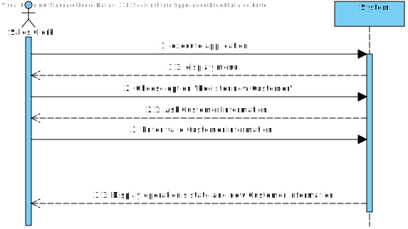

# US1003
=======================================

# 1. Requirements

**US1003** - As Sales Clerk, I want to register a new customer.
___
A Customer is composed of name, a valid Value-Added Tax (VAT)
identifier, an email address, and a phone number. **This is the mandatory information required by all customer to be appart of our system.**
Additionally, customers might state their birthdate
and gender and have billing and delivering postal address.

Reference: [Specifications document section 2.1, page 2](https://moodle.isep.ipp.pt/pluginfile.php/201265/mod_resource/content/2/LEI-2021-22-Sem4-Project_v3-SystemDescription.pdf)
___

- Name: at least a first and last name is required.
- VAT ID varies from one country to another. its consisted of letters and number.
- Phone number: according to international standards (e.g.: +351 934 563 123).
- Birthday: year/month/day.

Reference: [Forum Question](https://moodle.isep.ipp.pt/mod/forum/discuss.php?d=15754#p20258)
___

According to the requirements specified previously and also the context of the integrative project within EAPLI and LAPR4, the plan for the user story is the followning:

- Create a sub-menu within the main menu UI with the title "Register Customer".
- Ask the clerk to insert an alphanumeric code for the customer's VAT id.
- Ask the clerk to insert the custumer's full name (or first and last name).
- Ask the clerk to insert the customer's email.
- Ask the clerk to insert the customer's phone number.
- **Optionally the clerk can insert the following information:**
- Ask the clerk to insert the customer's gender.
- Ask the clerk to insert the customer's birthDate.
- Ask the clerk to insert the customer's City billing address.
- Ask the clerk to insert the customer's Street  billing address.
- Ask the clerk to insert the customer's HouseNumber  billing address.
- Ask the clerk to insert the customer's City delivery address.
- Ask the clerk to insert the customer's Street delivery address.
- Ask the clerk to insert the customer's HouseNumber delivery address.

- Validate if the vatID doesn't match with any already registered in the city, same goes for the phone number and email address.
- Validate if the phone number is in a correct format.
- Validate if the email has a valid format.

# 2. Analysis
The analysis done for this user story was heavily influenced by the example project provided in the class of EAPLI. The example project can be found at this link: https://bitbucket.org/pag_isep/ecafeteria-base/src/master/

## User interaction
### Menu Layout
To make sure that the clerk was able to easily interact with the functionality to register a new customer, the planned approach consisted in creating a sub-menu within the main menu with the title **Costumers**. The sub-menu **Register a new Customer** should be the one chosen in order to register a new customer. 

### Error Handling
The expected failed scenarios for this user story are the following:
- VatID is already registered in the system.
- the Email or phone number are not valid or already registered in the system.

In all of the above-mentioned failed scenarios, a user-friendly message needs to be displayed and specifying what caused the failure scenario.

## Domain concepts
According to the gathered requirements and also the user story specification, we could extract the following domain concepts:

### Entities
From the user story and the project specification, we can extract the logical consequence that the system/application should be able to manage multiple customers and each customer has its own unique identity hence on our system a Customer entity needs to exist.

### Value Objects
According to the gathered requirements regarding the composition of the name( as a designation), phone number, email, birth date, gender, address, we can extract the logical consequence that two value objects should exist 

**Value Objects**: Designation, phoneNumber, Email, birthDate, gender, addres.

### Application Engineering
The developed code should follow an approach where there is a clear separation of concerns within the application and a clear division of responsibilities for each developed class, meaning, there should be a clear separation between the code that is meant to handle the User Interface, the code that is meant to handle the persistence of the product categories and also the code that is meant to make sure the business rules are applied properly. 
In order to adhere to the previous statement the approach taken consisted of employing the following layers for the developed code:

**Action Layer**: The action layer is responsible for initiating the action necessary to display the correct user interface to the user so that the clerk can register a new customer.

**User Interface Layer**: The user interface layer is responsible for handling all the user inputs and all the interaction with the clerk.

**Controller Layer**: The controller layer is responsible for receiving the user input from the UI and performing the necessary operations that are needed to fulfill the user story.

**Persistence Layer**: The persistence layer is responsible for actually persisting the data that is meant to be persisted under the context of the user story.

**Domain Layer**: The domain layer is responsible for employing and enforcing all the business rules related to the product category, e.g Phone number should not be empty and a minimum of 9 numbers.

This layered approach helps to adhere to vital SOLID principles such as the Single Responsibility Principle and Open Closed Principle.

# 3. Design

## 3.1. Realization of Functionality
The following system sequence diagram displays the interaction between the user and the system:

**System Sequence Diagram**:

The following sequence diagram displays the interaction between all the developed components inherent to this user story:

**Sequence Diagram**:

## 3.2. Class Diagram
In order to make the different layers of the application loosely coupled a set of interfaces was defined to make sure that the dependencies between layers were upon abstractions and not actual concrete implementations. The defined interfaces were: RegisterCustomerController and CustomerRepository. 

The RegisterCustomerController interface defines the contract fulfilled by the controller or the supported operations by the controller layer.

The CustomerRepository interface defines the contract fulfilled by the repository or the supported operations by the persistence layer. 

## 3.3. Software Patterns

### Layered architecture
As alreayd mentioned on other sections of this document and also the previously displayed class diagram, a well thought out layered approach was followed for the development of this feature. Five layers were developed with concrete responsibilities in mind:

**Action Layer**: The action layer is responsible for initiating the action necessary to display the correct user interface to the clerk so that the user can register a new customer.

**User Interface Layer**: The user interface layer is responsible for handling all the user inputs and all the interaction with the user.

**Controller Layer**: The controller layer is responsible for receiving the user input from the UI and perform the necessary operations that are needed to fulfill the user story.

**Persistence Layer**: The persistence layer is responsible for actually persisting the data that is meant to be persisted under the context of the user story.

**Domain Layer**: The domain layer is responsible for employing and enforcing all the business rules related to the customer, e.g Phone number should not be empty and a minimum of 9 numbers.

### SOLID Principles
According to the class diagrams displayed and also the explanations provided in the Design section we can infer that the following SOLID principles were employed in the developed of this feature:

**Single Responsibility Principle**: Each developed class has a specific purpose attributed to it and a specific responsibility assigned to it. This can also be inferred from the very small set of methods provided by each class.

**Open/Closed Principle**: Each developed class can be further extended but cannot be modified as its behavior is strictly defined and well outlined.

**Interface Segregation Principle**: Each defined interface is really small in size and very specific which adheres to the principle of Interface Segregation from SOLID.

**Dependency Inversion Principle**: Dependencies between modules are bound by the abstractions created by the interfaces and not by actual concrete implementations, which adhere to the principle of dependency inversion from SOLID.

### Explicit dependencies
From the class diagram, one can infer that each class has a constructor explicitly defining the dependencies that the class needs in order to perform its operations which is considered to a good practice to follow since it makes it transparent to the consumer of the class which is the dependencies of the consumed class. 

The usage of explicit dependencies also helps with unit testing since it allows for "injected" mocked versions of the dependencies which can be manipulated and leveraged in order to create unit tests with the dependencies isolated from the class to be tested.

### Interfaces
One can infer from the class diagram that interfaces were defined and used during the development of this feature. The usage of these interfaces makes the codebase more coherent and promotes well-defined responsibilities. Interfaces were also used to make sure that the different modules of the developed code can depend upon abstractions and not actual concrete implementations. The usage of interfaces also made it easier and improved the created unit tests, since the usage of dependencies through interfaces allows the usage of mocks in order to isolate dependencies from the classes being tested.

### Immutability
One can infer from the class diagram that each developed class has a single constructor with all the required dependencies and no setters defined. This promotes immutability within the codebase which also helps to have concrete and predictable behavior in the code that was developed.

## 3.4. Tests 

### Regular Unit Tests

Unit tests were created to ensure basic integrity within the developed code. Example of a unit test to ensure a null check is performed on an explicit dependency of the RegisterProductCategoryController:

### Business Logic

### User Story

User story tests were created to ensure the basic functionality of the user story:

# 4. Implementation

Implementation of the user story went according to the plan and the analysis described on this document.

## Commits

## Tasks

# 5. Integration/Demonstration
N/A

# 6. Observations
None

