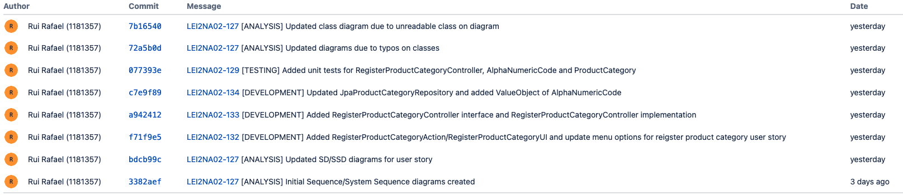

# US1005
=======================================

# 1. Requirements

**US1005** - As Sales Clerk, I want to define a new category of products.
___
A product category is composed of only an alphanumeric code and a description: **"By simplicity, a category consists only of an alphanumeric code, and a description. Each product belongs mandatorily to a single category."**. 

Reference: [Specifications document section 2.1](https://moodle.isep.ipp.pt/pluginfile.php/201265/mod_resource/content/2/LEI-2021-22-Sem4-Project_v3-SystemDescription.pdf)
___
There is no hierarchy between categories. 

Reference: [Forum Question](https://moodle.isep.ipp.pt/mod/forum/discuss.php?d=15796)
___
The alphanumeric code for the product category can't be empty and it must have a maximum of 10 characters.

Reference: [Forum Question](https://moodle.isep.ipp.pt/mod/forum/discuss.php?d=15987)
___

The description for the product category can't be empty, with a minimum of 20 characters and a maximum of 50 characters.

Reference: [Forum Question](https://moodle.isep.ipp.pt/mod/forum/discuss.php?d=15987)
____

According to the requirements specified previously and also the context of the integrative project within EAPLI and LAPR4, the plan for the user story is the followning:

- Create a sub menu within the main menu UI with the title "Register Product Category".
- Ask the user to insert a alphanumeric code for the new product category.
- Ask the user to insert a description for the new product category.
- Validate if the alphanumeric code provided by the user adheres to the business rules for the composition of the alphanumeric code.
- Validate if the description provided by the user adheres to the business rules for the composition of the description.
- Validate if exists a product category with the same alphanumeric code provided by the user. If this scenario occurs, an error message should be displayed to the user stating that there's 
an product category registered with the specified alphanumeric code.
- If the previous scenario does not occur, a new product category should be created and a success message should be return to the user.

# 2. Analysis
The analysis done for this user story was heavily influenced by the example project provided on the class of EAPLI. The example project can be found in this link: https://bitbucket.org/pag_isep/ecafeteria-base/src/master/

## User interaction
### Menu Layout
To make sure that the user was able to easily interact with the functionality to register a new product category and to establish the initial base menu for all potential user stories related to product categories, the planned approached consisted in creating a sub-menu within the main-menu with the title **Product Categories**. The sub-menu **Product Categories** should also display all the available functionalities related to product categories in a drop-down list. 

### Error Handling
The expected failed scenarios for this user story are the following:
- Alphanumeric code which does not adhere to the business rules for the alphanumeric code.
- Product category description which does not adhere to the business rules for the product category description.
- Product category already registered with the same alphanumeric code specified by the user.

In all of the above mentioned failed scenarios a user friendly message needs to be displayed and specifying exactly what caused the failed scenario.

## Domain concepts
According to gathered requirements and also the user story specification we could extract the following domain concepts:

### Entities
From the user story and the project specification we can extract the logical consequence that the system/application should be able to manage multiple product categories and each product category has it's own unique identity hence on our system a Product Category entity needs to exists.

### Value Objects
According to the gathered requirements regarding the composition of the alphanumeric code and description for each product category we can extract the logical consequence that two value objects should exist 

**Value Objects**: ProductCategoryCode, ProductCategoryDescription

### Application Engineering
The developed code should follow an approach where there is a clear separation of concerns within the application and a clear division of responsibilities for each developed class, meaning, there should be a clear separation between the code that is meant to handle the User Interface, the code that is meant to handle the persistence of the product categories and also the code that is meant to make sure the business rules are applied properly. 
In order to adhere to the previous statement the approach taken consisted of employing the following layers for the developed code:

**Action Layer**: The action layer is responsibile for initating the action necessary to display the correct user interface to the user so that the user can register a new product category.

**User Interface Layer**: The user interface layer is responsible for handling all the user input's and all the interaction with the user.

**Controller Layer**: The controller layer is responsible for receiving the user input's from the UI and perform the necessary operations that are needed to fullfill the user story.

**Persistence Layer**: The persistance layer is responsible for actually persisting the data that is meant to be persisted under the context of the user story.

**Domain Layer**: The domain layer is responsible for employing and enforcing all the business rules related to the product category, e.g Alphanumeric code should not be empty and maximum of 20 characters.

This layered approach helps to adhere to vital SOLID principles such as the Single Responsability Principle and Open Closed Principle.

# 3. Design

*Nesta secção a equipa deve descrever o design adotado para satisfazer a funcionalidade. Entre outros, a equipa deve apresentar diagrama(s) de realização da funcionalidade, diagrama(s) de classes, identificação de padrões aplicados e quais foram os principais testes especificados para validar a funcionalidade.*

*Para além das secções sugeridas, podem ser incluídas outras.*

## 3.1. Realization of Functionality
The following system sequence diagram displays the interaction between the user and the system:

**System Sequence Diagram**:

The following sequence diagram displays the interaction between all the developed components inherent to this user story:

**Sequence Diagram**:

## 3.2. Class Diagram
In order to make the different layers of the application loosely coupled a set of interfaces were defined to make sure that the dependencies between layers were upon abstractions and not actual concrete implementations. The defined interfaces were: RegisterProductCategoryController and ProductCategoriesRepository. 

The RegisterProductCategoryController interface defines the contract fulfilled by the controller or the supported operations by the controller layer.

The ProductCategoriesRepository interface defines the contract fulfilled by the repository or the supported operations by the persistance layer. 

According to what was described in the analysis section, an entity and two value objects were created. The ProductCategory class represents the domain entity and the classes AlphaNumericCode and Description represent the domain value objects.

## 3.3. Software Patterns

### Layered architecture
As alreayd mentioned on other sections of this document and also the previously displayed class diagram, a well tought out layered approach was followed for the development of this feature. 5 layers were developed with concrete responsabilities in mind:

**Action Layer**: The action layer is responsibile for initating the action necessary to display the correct user interface to the user so that the user can register a new product category.

**User Interface Layer**: The user interface layer is responsible for handling all the user input's and all the interaction with the user.

**Controller Layer**: The controller layer is responsible for receiving the user input's from the UI and perform the necessary operations that are needed to fullfill the user story.

**Persistence Layer**: The persistance layer is responsible for actually persisting the data that is meant to be persisted under the context of the user story.

**Domain Layer**: The domain layer is responsible for employing and enforcing all the business rules related to the product category, e.g Alphanumeric code should not be empty and maximum of 20 characters.

### SOLID Principles
According to the class diagrams displayed and also the explanations provided in the Design section we can infer that the following SOLID principles were employed on the developed of this feature:

**Single Responsability Principle**: Each developed class has a specific purpose attributed to it and a specific responsability assigned to it. This can also be infered from the very small set of methods provided by each class.

**Open/Closed Principle**: Each developed class can be further extended but cannot be modified as it's behavior is strictly defined and well outlined.

**Interface Segregation Principle**: Each defined interface is really small in size and very specific which adheres to the principle of Interface Segregation from SOLID.

**Dependency Inversion Principle**: Dependencies between modules are bound by the abstractions created by the interfaces and not by actual concrete implementations, which adheres to the principle of dependency inversion from SOLID.

### Explicit dependencies
From the class diagram one can infer that each class has a constructor explicitly defining the dependencies that the class needs in order to perform it's operations which is considered to a good pratice to follow since it makes transparent to the consumer of the class which are the dependencies of the consumed class. 

The usage of explicit dependencies also helps with unit testing since it allows to "injected" mocked versions of the dependencies which can be manipulated and leveraged in order to create unit tests with the dependencies isolated from the class to be tested.

### Interfaces
One can infer from the class diagram that interfaces were defined and used during the development of this feature. The usage of these interfaces makes the codebase more coherent and promotes well defined responsibilities. Interfaces were also used to make sure that the different modules of the developed code can depend upon abstractions and not actual concrete implementations. The usage of interfaces also made it easier and improved the created unit tests, since the usage of dependencies through interfaces allows the usage of mocks in order to isolate dependencies from the classes being tested.

### Immutability
One can infer from the class diagram that each developed class has a single constructor with all the required dependencies and no setters defined. This promotes immutability within the codebase which also helps to have concrete and predictable behavior in the code that was developed.

## 3.4. Tests 

### Regular Unit Tests

Unit tests were created to ensure basic integrity within developed code. Example of a unit test to ensure a null check is performed on an explicity dependency of the RegisterProductCategoryController:

**Null check:** Validates if an exception is thrown when a null argument is passed

	 @Test
        public void Invalid_NullProductCategoryRepository_ShouldThrowIllegalArgumentException(){
            // Act & Assert
            assertThrows(IllegalArgumentException.class, () -> new RegisterProductCategoryControllerImpl(null));
        }
___

### Business Logic

Business logic tests were created to ensure that the intended business rules are ensured.

**Empty alpha numeric code:** Validates if an empty alpha numeric code was sent.

		@Test
		public void Invalid_EmptyString_ShouldThrowIllegalArgumentException(){
			// Act & Assert
			assertThrows(IllegalArgumentException.class, () -> ProductCategoryCode.valueOf(""));
		}

**Maximum length on alpha numeric code exceeded:** Validates if the maximum length for the alpha numeric code was exceeded.

	  	@Test
		public void Invalid_CodeExceedsMaximumLength_ShouldThrowIllegalArgumentException(){
			// Act & Assert
			assertThrows(IllegalArgumentException.class, () -> ProductCategoryCode.valueOf("MAXIMUMLENGTHEXCEEED"));
		}

**Empty description:** Validates if an empty description was sent.

		@Test
		public void Invalid_EmptyString_ShouldThrowIllegalArgumentException(){
			// Act & Assert
			assertThrows(IllegalArgumentException.class, () -> ProductCategoryDescription.valueOf(""));
		}

**Maximum length on description exceeded:** Validates if the maximum length for the description was exceeded.

	  	@Test
		public void Invalid_DescriptionExceedsMaximumLength_ShouldThrowIllegalArgumentException(){
			// Act & Assert
			assertThrows(IllegalArgumentException.class, () -> ProductCategoryDescription.valueOf("MAXIMUMLENGTHEXCEEEDBYALOTOFCHARACTERSAAAAAAAAAAAAAAAAAAAAAAAAAAAAAAAAAAAAAAAAAAAAAAAAAAAAAAAAAAAAAAAAAA"));
		}

**Minimum length on description not met:** Validates if the minimum length for the description was met.

	  	@Test
		public void Invalid_DescriptionDoesNotHaveMinimumLength_ShouldThrowIllegalArgumentException(){
			// Act & Assert
			assertThrows(IllegalArgumentException.class, () -> ProductCategoryDescription.valueOf("MINLENGTH"));
		}

___

### User Story

User story tests were created to ensure the basic functionality of the user story:

**Product category already registered:** Validates if an exception is thrown when a product category already exists with the specified alpha numeric code:

	  	@Test
        public void Invalid_ExistentAlphaCodeForProductCategory_ShouldThrowIntegrityViolationException(){
            // Arrange
            var alphaCode = "TESTCATEGORY1234";
            var description = "TEST NEW PRODUCT CATEGORY";

            when(mockProductCategoryRepository.containsOfIdentity(any(AlphaNumericCode.class))).thenReturn(true);

            // Act & Assert
            assertThrows(IntegrityViolationException.class, () -> productCategoryController.registerProductCategory(alphaCode, description));

            // Assert
            verify(mockProductCategoryRepository).containsOfIdentity(any(AlphaNumericCode.class));
        }

**Registration of a product category:** Validates if the product category is actually registed if valid data is sent:

	  	@Test
        public void Valid_NonExistentAlphaCodeForProductCategory_ShouldInsertNewProductCategoryAndNotThrowException(){
            // Arrange
            var alphaCode = "TESTCATEGORY1234";
            var description = "TEST NEW PRODUCT CATEGORY";

            when(mockProductCategoryRepository.containsOfIdentity(any(AlphaNumericCode.class))).thenReturn(false);
            when(mockProductCategoryRepository.save(any(ProductCategory.class))).thenReturn(any());

            // Act & Assert
            assertDoesNotThrow(() -> productCategoryController.registerProductCategory(alphaCode, description));

            // Assert
            verify(mockProductCategoryRepository).containsOfIdentity(any(AlphaNumericCode.class));
            verify(mockProductCategoryRepository).save(any());
        }

# 4. Implementation

Implementation of the user story went according to the plan and the analysis described on this document.

## Commits

## Tasks

# 5. Integration/Demonstration

During the development of this feature an effort has been made to make sure the developed code could be reused in other user stories for this sprint such as the user story US1001. To make sure that code was reusable, an effort was made to make sure the code was as much modular as possible so that different modules could be implemented in other stories, such as the ProductCategoryRepository module for example.

# 6. Observations
None

