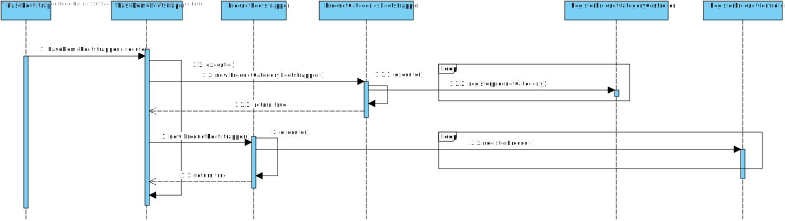
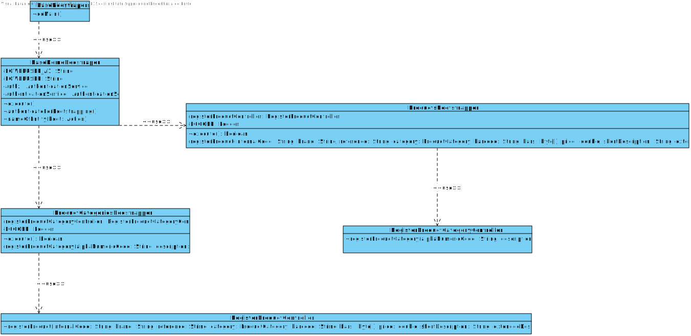
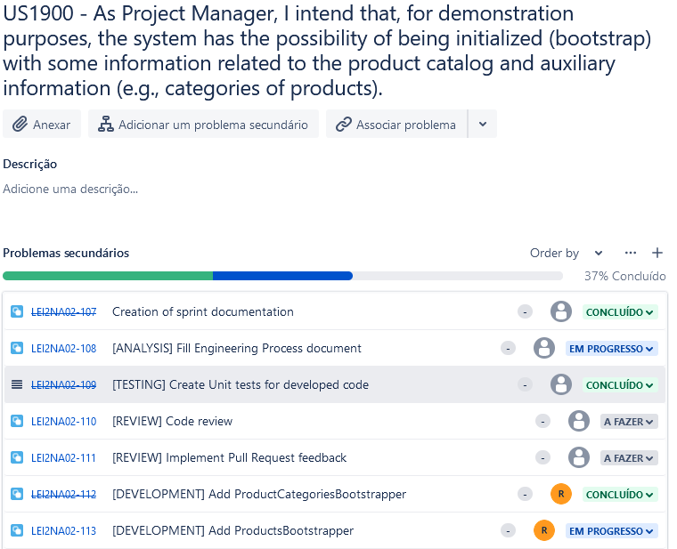

# US1900
=======================================

# 1. Requirements

**US1900** -  As Project Manager, I intend that, for demonstration purposes, the system has the possibility of being initialized (bootstrap) with some information related to the product catalog and auxiliary information (e.g., categories of products).
___
A product category is composed of only an alphanumeric code and a description: **"By simplicity, a category consists only of an alphanumeric code, and a description. Each product belongs mandatorily to a single category."**. 

Reference: [Specifications document section 2.1](https://moodle.isep.ipp.pt/pluginfile.php/201265/mod_resource/content/2/LEI-2021-22-Sem4-Project_v3-SystemDescription.pdf)
___
There is no hierarchy between categories. 

Reference: [Forum Question](https://moodle.isep.ipp.pt/mod/forum/discuss.php?d=15796)
___
The alphanumeric code for the product category can't be empty and it must have a maximum of 10 characters.

Reference: [Forum Question](https://moodle.isep.ipp.pt/mod/forum/discuss.php?d=15987)
___

The description for the product category can't be empty, with a minimum of 20 characters and a maximum of 50 characters.

Reference: [Forum Question](https://moodle.isep.ipp.pt/mod/forum/discuss.php?d=15987)
____

According to the requirements specified previously and also the context of the integrative project within EAPLI and LAPR4, the plan for the user story is the followning:

- Create a bootstrap that once executed will create a number of products and produc categories with the objective of having a application with some information when executed by someone.

# 2. Analysis
The analysis done for this user story was heavily influenced by the example project provided in the class of EAPLI. The example project can be found at this link: https://bitbucket.org/pag_isep/ecafeteria-base/src/master/

## User interaction

## Domain concepts
According to the gathered requirements and also the user story specification, we could extract the following domain concepts:

### Entities
From the user story and the project specification, we can extract the logical consequence that the system/application should be able to manage multiple product categories and each product category has its own unique identity hence on our system a Product Category entity needs to exist.

### Value Objects
According to the gathered requirements regarding the composition of the alphanumeric code and description for each product category, we can extract the logical consequence that two value objects should exist 

**Value Objects**: ProductCategoryCode, ProductCategoryDescription

### Application Engineering

**Controller Layer**: The controller layer is responsible for receiving the user input from the UI and performing the necessary operations that are needed to fulfill the user story.

**Persistence Layer**: The persistence layer is responsible for actually persisting the data that is meant to be persisted under the context of the user story.

This layered approach helps to adhere to vital SOLID principles such as the Single Responsibility Principle and Open Closed Principle.

# 3. Design

## 3.1. Realization of Functionality
The following system sequence diagram displays the interaction between the user and the system:

**Sequence Diagram**:

## 3.2. Class Diagram
In order to make the different layers of the application loosely coupled a set of interfaces was defined to make sure that the dependencies between layers were upon abstractions and not actual concrete implementations. The defined interfaces were: RegisterProductCategoryController and ProductCategoriesRepository. 

The RegisterProductCategoryController interface defines the contract fulfilled by the controller or the supported operations by the controller layer.

The ProductCategoriesRepository interface defines the contract fulfilled by the repository or the supported operations by the persistence layer. 

## 3.3. Software Patterns

### Layered architecture

**Controller Layer**: The controller layer is responsible for receiving the user input from the UI and perform the necessary operations that are needed to fulfill the user story.

**Persistence Layer**: The persistence layer is responsible for actually persisting the data that is meant to be persisted under the context of the user story.

### SOLID Principles
According to the class diagrams displayed and also the explanations provided in the Design section we can infer that the following SOLID principles were employed in the developed of this feature:

**Single Responsibility Principle**: Each developed class has a specific purpose attributed to it and a specific responsibility assigned to it. This can also be inferred from the very small set of methods provided by each class.

**Open/Closed Principle**: Each developed class can be further extended but cannot be modified as its behavior is strictly defined and well outlined.

**Interface Segregation Principle**: Each defined interface is really small in size and very specific which adheres to the principle of Interface Segregation from SOLID.

**Dependency Inversion Principle**: Dependencies between modules are bound by the abstractions created by the interfaces and not by actual concrete implementations, which adhere to the principle of dependency inversion from SOLID.

### Explicit dependencies
From the class diagram, one can infer that each class has a constructor explicitly defining the dependencies that the class needs in order to perform its operations which is considered to a good practice to follow since it makes it transparent to the consumer of the class which is the dependencies of the consumed class. 

The usage of explicit dependencies also helps with unit testing since it allows for "injected" mocked versions of the dependencies which can be manipulated and leveraged in order to create unit tests with the dependencies isolated from the class to be tested.

### Interfaces
One can infer from the class diagram that interfaces were defined and used during the development of this feature. The usage of these interfaces makes the codebase more coherent and promotes well-defined responsibilities. Interfaces were also used to make sure that the different modules of the developed code can depend upon abstractions and not actual concrete implementations. The usage of interfaces also made it easier and improved the created unit tests, since the usage of dependencies through interfaces allows the usage of mocks in order to isolate dependencies from the classes being tested.

### Immutability
One can infer from the class diagram that each developed class has a single constructor with all the required dependencies and no setters defined. This promotes immutability within the codebase which also helps to have concrete and predictable behavior in the code that was developed.

## 3.4. Tests 

### Regular Unit Tests

Unit tests were created to ensure basic integrity within the developed code. Example of a unit test to ensure a null check is performed on an explicit dependency of the RegisterProductCategoryController:

**Null check:** Validates if an exception is thrown when a null argument is passed

	 @Test
        public void Invalid_NullProductCategoryRepository_ShouldThrowIllegalArgumentException(){
            // Act & Assert
            assertThrows(IllegalArgumentException.class, () -> new RegisterProductCategoryControllerImpl(null));
        }
___

### Business Logic

Business logic tests were created to ensure that the intended business rules are ensured.

**Empty alphanumeric code:** Validates if an empty alphanumeric code was sent.

		@Test
		public void Invalid_EmptyString_ShouldThrowIllegalArgumentException(){
			// Act & Assert
			assertThrows(IllegalArgumentException.class, () -> ProductCategoryCode.valueOf(""));
		}

**Maximum length on alphanumeric code exceeded:** Validates if the maximum length for the alphanumeric code was exceeded.

	  	@Test
		public void Invalid_CodeExceedsMaximumLength_ShouldThrowIllegalArgumentException(){
			// Act & Assert
			assertThrows(IllegalArgumentException.class, () -> ProductCategoryCode.valueOf("MAXIMUMLENGTHEXCEEED"));
		}

**Empty description:** Validates if an empty description was sent.

		@Test
		public void Invalid_EmptyString_ShouldThrowIllegalArgumentException(){
			// Act & Assert
			assertThrows(IllegalArgumentException.class, () -> ProductCategoryDescription.valueOf(""));
		}

**Maximum length on description exceeded:** Validates if the maximum length for the description was exceeded.

	  	@Test
		public void Invalid_DescriptionExceedsMaximumLength_ShouldThrowIllegalArgumentException(){
			// Act & Assert
			assertThrows(IllegalArgumentException.class, () -> ProductCategoryDescription.valueOf("MAXIMUMLENGTHEXCEEEDBYALOTOFCHARACTERSAAAAAAAAAAAAAAAAAAAAAAAAAAAAAAAAAAAAAAAAAAAAAAAAAAAAAAAAAAAAAAAAAA"));
		}

**Minimum length on description not met:** Validates if the minimum length for the description was met.

	  	@Test
		public void Invalid_DescriptionDoesNotHaveMinimumLength_ShouldThrowIllegalArgumentException(){
			// Act & Assert
			assertThrows(IllegalArgumentException.class, () -> ProductCategoryDescription.valueOf("MINLENGTH"));
		}

___

## Commits

## Tasks

# 5. Integration/Demonstration

N/A

# 6. Observations
None

