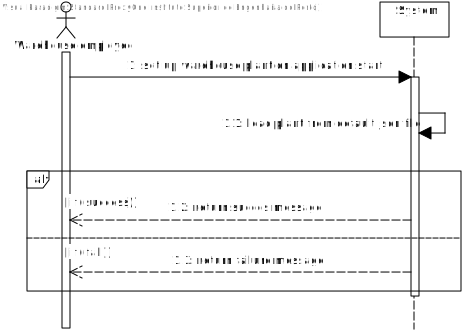
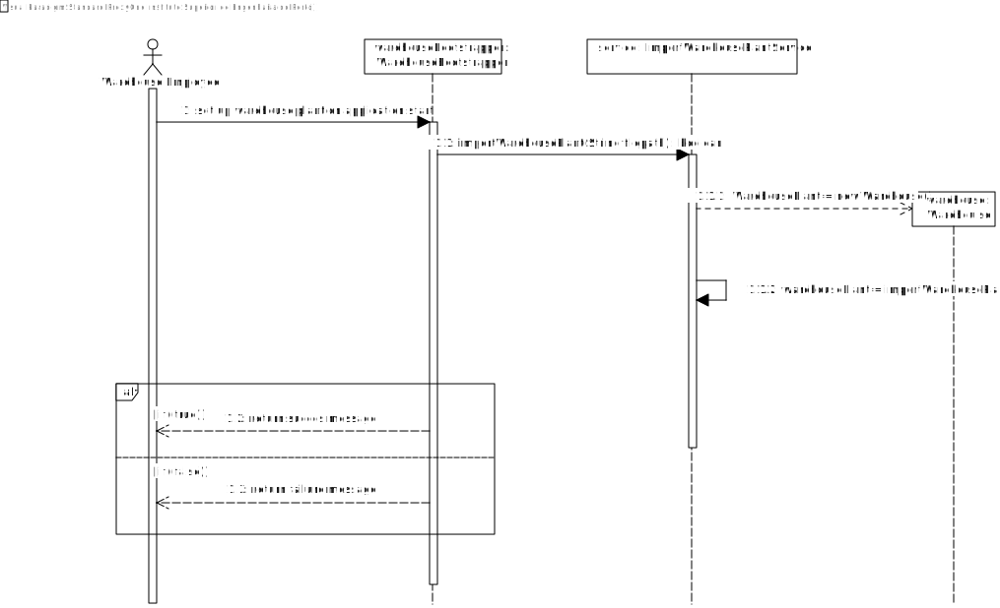
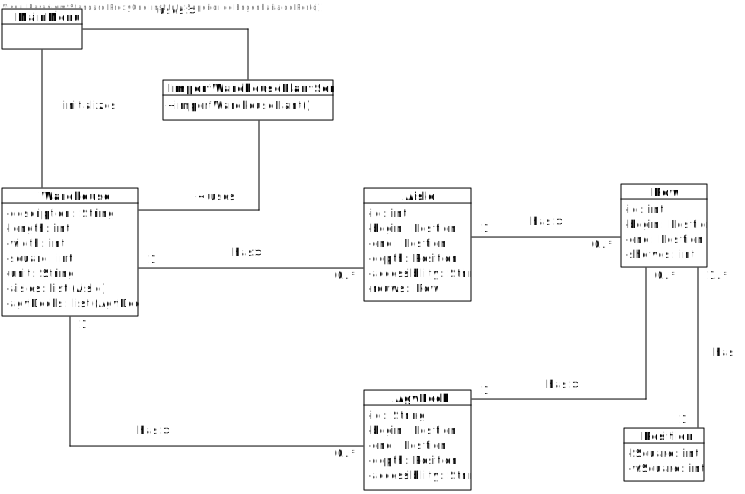

# US2001
=======================================

# 1. Requirements

**US2001** - As Warehouse Employee, I want to set up the warehouse plant by uploading a JSON file.

___

- Only one warehouse [US2001](https://moodle.isep.ipp.pt/mod/forum/discuss.php?d=15995)
- Only upload file [WareHousePlant 2001](https://moodle.isep.ipp.pt/mod/forum/discuss.php?d=15972)
- Not required to persist warehouse plant data[Esclarecimentos adicionais sobre alguns casos de uso ](https://moodle.isep.ipp.pt/mod/forum/discuss.php?d=16072)
___

According to the requirements specified previously and also the context of the integrative project within EAPLI and LAPR4, the plan for the user story is the following:

- Autoload the warehouse plant data on aplication start.
- Load the data from a predefined path.
- Data constraints Warehouse:
  - description: String, required;
  - length: int, required;
  - width: int, required;
  - square: int, required;
  - unit: String, required;
  - aisles: list of aisles;
  - agvDocks: list of agvDocks

- Data constraints Aisle:
  - id: int required;
  - begin: positive set of two coordinates greater than zero;
  - end: positive set of two coordinates greater than zero;
  - deph: positive set of two coordinates greater than zero;
  - accessibility: String, required;
  - rows: list of rows

- Data constraints agvDock:
  - id: String required;
  - begin: positive set of two coordinates greater than zero;
  - end: positive set of two coordinates greater than zero;
  - deph: positive set of two coordinates greater than zero;
  - accessibility: String, required

- Data constraints Row:
  - id: int required;
  - begin: positive set of two coordinates greater than zero;
  - end: positive set of two coordinates greater than zero;
  - shelves: int required

# 2. Analysis
The analysis done for this user story was heavily influenced by the example project provided on the class of EAPLI. The example project can be found in this link: https://bitbucket.org/pag_isep/ecafeteria-base/src/master/

## User interaction
### Menu Layout
It is not required to use this function from the main menu, still, for demo pourpose the option to run this functionality will be available on the main menu under warehouse (7).

### Error Handling
The expected failed scenarios for this user story occur if the source file is missing, incompatible, or with invalid values.

In all of the above mentioned failed scenarios a user friendly message needs to be displayed and specifying exactly what caused the failed scenario.

## Domain concepts
According to gathered requirements and also the user story specification we could extract the following domain concepts:

### Entities
Though it is not required to persist the data there is still the need to create the necessary model classes:
  - Warehouse
  - AgvDock
  - Aisle
  - Row
  - Position

### Application Engineering
The developed code should follow an approach where there is a clear separation of concerns within the application and a clear division of responsibilities for each developed class, meaning, there should be a clear separation between the code that is meant to handle the User Interface, the code that is meant to handle the persistence of the product and also the code that is meant to make sure the business rules are applied properly. 
In order to adhere to the previous statement the approach taken consisted of employing the following layers for the developed code.

**Action Layer**: The action layer is responsible for initiating the action necessary to display the correct user interface to the user so that the user can demo the functionality.

**User Interface Layer**: The user interface layer is responsible for handling all the user input's and all the interaction with the user.

**Controller Layer**: The controller layer is responsible for receiving the user input's from the UI and perform the necessary operations that are needed to fullfil the user story.

**Domain Layer**: The domain layer is responsible for employing and enforcing all the business rules related to the product, the services are also included her to provide a central are for resources that may be needed.

This layered approach helps to adhere to vital SOLID principles such as the Single Responsibility Principle and Open Closed Principle.

# 3. Design

## 3.1. Realization of Functionality
The following system sequence diagram displays the interaction between the user and the system:

**System Sequence Diagram**:

The following sequence diagram displays the interaction between all the developed components inherent to this user story:

**Sequence Diagram**:
Since the use of the menu in this US is to be used only for demo pourposes the classes used in such will not be displayed in the following diagrams

## 3.2. Class Diagram

## 3.3. Software Patterns

### Layered architecture
As already mentioned on other sections of this document and also the previously displayed class diagram, a well toughs out layered approach was followed for the development of this feature. 5 layers were developed with concrete responsibilities in mind:

**Action Layer**: The action layer is responsible for initiating the action necessary to display the correct user interface to the user so that the user can register a new product category.

**User Interface Layer**: The user interface layer is responsible for handling all the user input's and all the interaction with the user.

**Controller Layer**: The controller layer is responsible for receiving the user input's from the UI and perform the necessary operations that are needed to fullfil the user story.

**Domain Layer**: The domain layer is responsible for employing and enforcing all the business rules related to the product category, e.g Alphanumeric code should not be empty and maximum of 20 characters.

### SOLID Principles
According to the class diagrams displayed and also the explanations provided in the Design section we can infer that the following SOLID principles were employed on the developed of this feature:

**Single Responsibility Principle**: Each developed class has a specific purpose attributed to it and a specific responsibility assigned to it. This can also be inferred from the very small set of methods provided by each class.

**Open/Closed Principle**: Each developed class can be further extended but cannot be modified as it's behavior is strictly defined and well outlined.

**Interface Segregation Principle**: Each defined interface is really small in size and very specific which adheres to the principle of Interface Segregation from SOLID.

**Dependency Inversion Principle**: Dependencies between modules are bound by the abstractions created by the interfaces and not by actual concrete implementations, which adheres to the principle of dependency inversion from SOLID.

### Explicit dependencies
From the class diagram one can infer that each class has a constructor explicitly defining the dependencies that the class needs in order to perform it's operations which is considered to a good practice to follow since it makes transparent to the consumer of the class which are the dependencies of the consumed class. 

The usage of explicit dependencies also helps with unit testing since it allows to "injected" mocked versions of the dependencies which can be manipulated and leveraged in order to create unit tests with the dependencies isolated from the class to be tested.

### Interfaces
One can infer from the class diagram that interfaces were defined and used during the development of this feature. The usage of these interfaces makes the codebase more coherent and promotes well defined responsibilities. Interfaces were also used to make sure that the different modules of the developed code can depend upon abstractions and not actual concrete implementations. The usage of interfaces also made it easier and improved the created unit tests, since the usage of dependencies through interfaces allows the usage of mocks in order to isolate dependencies from the classes being tested.

### Immutability
One can infer from the class diagram that each developed class has a single constructor with all the required dependencies and no setters defined. This promotes immutability within the codebase which also helps to have concrete and predictable behavior in the code that was developed.

## 3.4. Tests 

**Excerpt of Warehouse tests**

@Test
    public void invalidEmptyDescriptionShouldThrowIllegalArgumentException() {

        assertThrows(IllegalArgumentException.class, () -> {
            Warehouse warehouse = new Warehouse(
                    "",
                    1,
                    1,
                    1,
                    "cm",
                    this.aisles,
                    this.agvDocks);
        });
    }

    @Test
    public void invalidNullDescriptionShouldThrowIllegalArgumentException() {

        assertThrows(IllegalArgumentException.class, () -> {
            Warehouse warehouse = new Warehouse(
                    null,
                    1,
                    1,
                    1,
                    "cm",
                    this.aisles,
                    this.agvDocks);
        });
    }

    @Test
    public void invalidNegativeLengthShouldThrowIllegalArgumentException() {

        assertThrows(IllegalArgumentException.class, () -> {
            Warehouse warehouse = new Warehouse(
                    "description",
                    -1,
                    1,
                    1,
                    "cm",
                    this.aisles,
                    this.agvDocks);
        });
    }

    @Test
    public void invalidNegativeWidthShouldThrowIllegalArgumentException() {

        assertThrows(IllegalArgumentException.class, () -> {
            Warehouse warehouse = new Warehouse(
                    "description",
                    1,
                    -1,
                    1,
                    "cm",
                    this.aisles,
                    this.agvDocks);
        });
    }

    @Test
    public void invalidNegativeSquareShouldThrowIllegalArgumentException() {

        assertThrows(IllegalArgumentException.class, () -> {
            Warehouse warehouse = new Warehouse(
                    "description",
                    1,
                    1,
                    -1,
                    "cm",
                    this.aisles,
                    this.agvDocks);
        });
    }

    @Test
    public void invalidEmptyUnitShouldThrowIllegalArgumentException() {

        assertThrows(IllegalArgumentException.class, () -> {
            Warehouse warehouse = new Warehouse(
                    "description",
                    1,
                    1,
                    1,
                    "",
                    this.aisles,
                    this.agvDocks);
        });
    }

    
    @Test
    public void invalidNullUnitShouldThrowIllegalArgumentException() {

        assertThrows(IllegalArgumentException.class, () -> {
            Warehouse warehouse = new Warehouse(
                    "description",
                    1,
                    1,
                    1,
                    null,
                    this.aisles,
                    this.agvDocks);
        });
    }

# 4. Implementation

Implementation of the user story went according to the plan and the analysis described on this document.

## Commits

## Tasks

# 5. Integration/Demonstration

During the development of this feature an effort has been made to make sure the developed code could be reused in other user stories for this sprint such as the user story US2002. To make sure that code was reusable, an effort was made to make sure the code was as much modular as possible so that different modules could be implemented in other stories.

# 6. Observations
None

