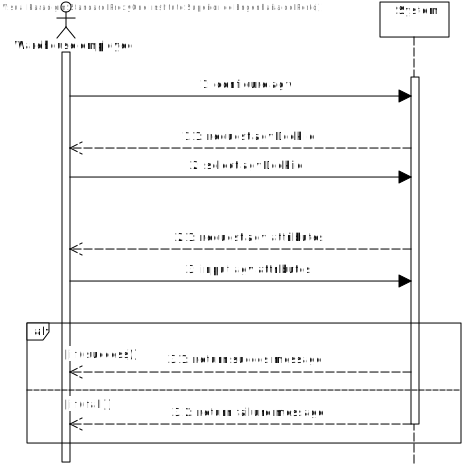
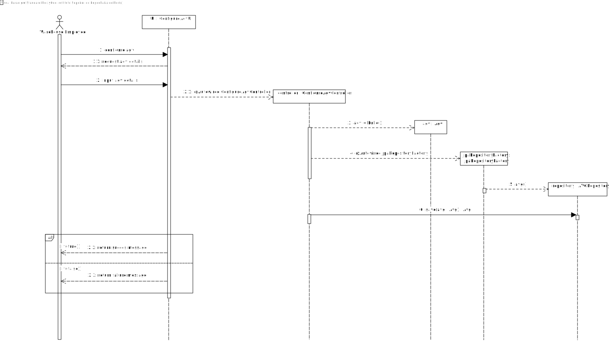
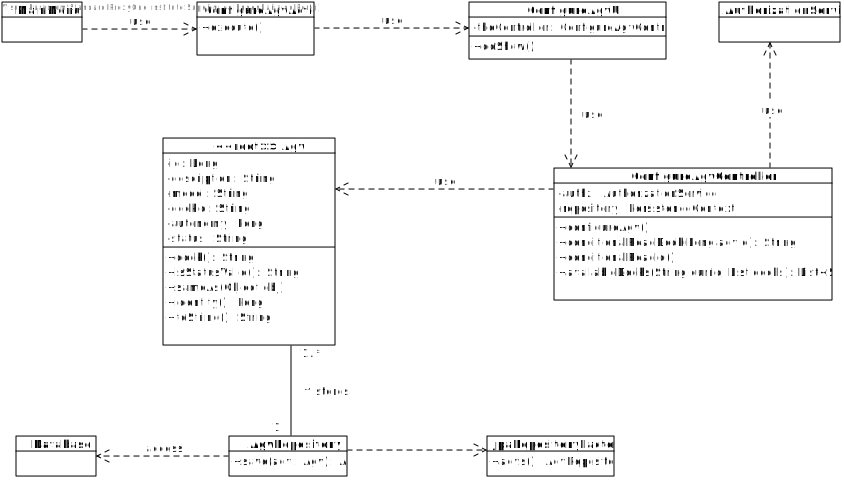

# US2002
=======================================

# 1. Requirements

**US2002** - As Warehouse Employee, I want to configure the AGVs available in the warehouse.

___

- Agv location is required [US2002](https://moodle.isep.ipp.pt/mod/forum/discuss.php?d=16073)
- Agv id is manualy inputed, only one agv per dock[US2002](https://moodle.isep.ipp.pt/mod/forum/discuss.php?d=15988)
- Agv autonomy in minutes, description is string with 30 length, model is string with 50 length, and follow common sense for others [US2002](https://moodle.isep.ipp.pt/mod/forum/discuss.php?d=15961)
___

According to the requirements specified previously and also the context of the integrative project within EAPLI and LAPR4, the plan for the user story is the following:

- All required fields must be inputed.
* **AC2:** Required fields (to input):
    - id (int 8)
	- description (string 30);
	- model (string 50);
	- max weight (double);
	- volume (double);
	- autonomy (int);

* **AC3:** Required fields (to select):
	- dockLocation (int);
	- task (String);

# 2. Analysis

The developed code should follow an approach where there is a clear separation of concerns within the application and a clear division of responsibilities for each developed class, meaning, there should be a clear separation between the code that is meant to handle the User Interface, the code that is meant to handle the persistence of the product and also the code that is meant to make sure the business rules are applied properly. 
In order to adhere to the previous statement the approach taken consisted of employing the following layers for the developed code.

## Domain concepts

According to the gathered requirements and also the user story specification, we could extract the following domain concepts:

**Entities:**

**AGV**: From the user story and the project specification, we can extract the logical consequence that the system/application should be able to manage multiple AGVs and each has it's own unique id.

This requires id, description, model, autonomy, dockid and status.

Value Objects: description, model, autonomy, dockid and status.

**Action Layer**: The action layer is responsible for initiating the action necessary to display the correct user interface to the user so that the user can demo the functionality.

**User Interface Layer**: The user interface layer is responsible for handling all the user input's and all the interaction with the user.

**Controller Layer**: The controller layer is responsible for receiving the user input's from the UI and perform the necessary operations that are needed to fullfil the user story.

**Domain Layer**: The domain layer is responsible for employing and enforcing all the business rules related to the product, the services are also included her to provide a central are for resources that may be needed.

This layered approach helps to adhere to vital SOLID principles such as the Single Responsibility Principle and Open Closed Principle.
# 3. Design

**System Sequence Diagram**

**Sequence Diagram**:
The following sequence diagram displays the interaction between all the developed components inherent to this user story:

## 3.2. Class Diagram

In order to make the different layers of the application loosely coupled, a set of interfaces were defined to make sure that the dependencies between layers were upon abstractions and not actual concrete implementations. The defined interfaces were: ConfigureAgvController and AgvRepository. 

The ConfigureAgvController interface defines the contract fulfilled by the controller or the supported operations by the controller layer.

The AgvRepository interface defines the contract fulfilled by the repository or the supported operations by the persistance layer. 

Acknowledgments: The creation of a builder class would be beneficial, to further decouple and take away the responsibility of instantiation of the Agv object.

# 3.4. Tests
n/a

# 4. Implementation

Implementation of the user story went according to the plan and the analysis described on this document.

## Commits

## Tasks

# 5. Integration/Demonstration

To make sure that code was reusable, an effort was made to make sure the code was as much modular as possible so that different modules could be implemented in other stories.

# 6. Observations
None

