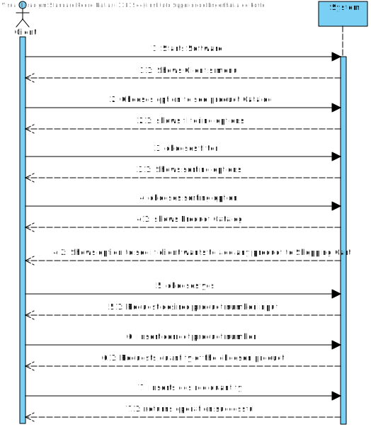
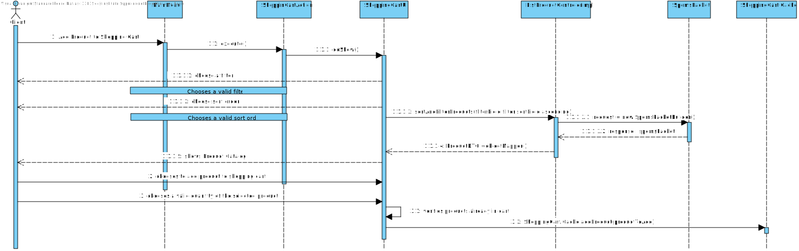
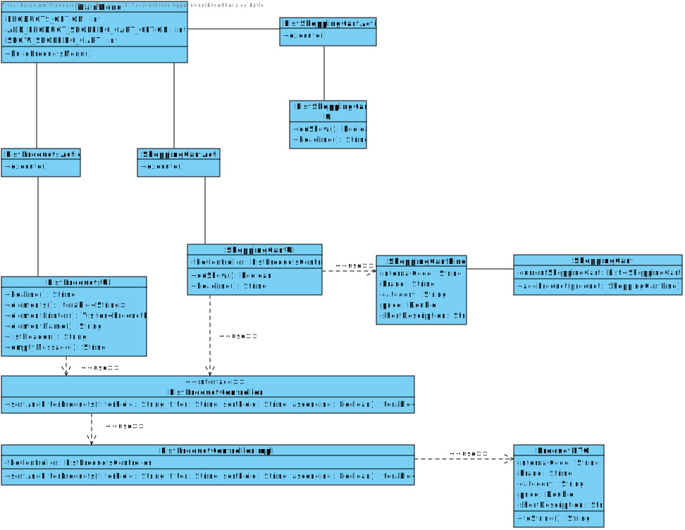
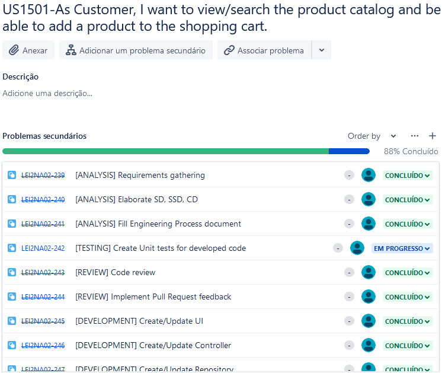

# US1501
=======================================

# 1. Requirements

**US1501** - As Customer, I want to view/search the product catalog and be able to add a product to the shopping cart.
___
A Customer needs to be able to view and apply filters to the product catalog in order to facilitate searching through all the products in the system.
A Customer also needs to be able to add a product to his shopping cart also specifiying the desired quantity.
___

- Display Product's Info on the Shopping Cart
- Display Product's Price on the Shopping Cart
- Display Product's Quantity on the Shopping Cart
- Display Total Price of all the items in the shopping cart

Reference: [Forum Question](https://moodle.isep.ipp.pt/mod/forum/discuss.php?d=16695#p21451)
___

According to the requirements specified previously and also the context of the integrative project within EAPLI and LAPR4, the plan for the user story is the followning:

- Create a sub-menu within the main menu UI with the title "Add a new product to the shopping cart".

- Ask the client if he wants to filter the product catalog;
- Ask the client if he want to sort the product catalog;
- Show the porduct catalog with the client's desired configurations;
- Ask the client if he wants to add a product from the product catalog to their shopping Cart;
- Ask the client the Number of the product he wants to add to his shopping cart;
- Ask the client the quantity of the selected product he wants to add to his shopping cart;

# 2. Analysis
The analysis done for this user story was heavily influenced by the example project provided in the class of EAPLI. The example project can be found at this link: https://bitbucket.org/pag_isep/ecafeteria-base/src/master/

## User interaction
### Menu Layout
To make sure that the client was able to easily interact with the functionality to add a product to his shopping cart, the planned approach consisted in creating a sub-menu within the main menu with the title **Products**. The sub-menu **Add a new product to the shopping cart** should be the one chosen in order to add a new item to his shopping cart. 

### Error Handling
The expected failed scenarios for this user story are the following:
- Invalid Product Number.
- Invalid Product Quantity.

In all of the above-mentioned failed scenarios, a user-friendly message needs to be displayed and specifying what caused the failure scenario.

## Domain concepts
According to the gathered requirements and also the user story specification, we could extract the following domain concepts:

### Value Objects
According to the gathered requirements regarding the composition of the shopping cart, we can extract the logical consequence that two value objects should exist.

**Value Objects**: ShoppingCart, ShoppingCartLine.

### Application Engineering
The developed code should follow an approach where there is a clear separation of concerns within the application and a clear division of responsibilities for each developed class, meaning, there should be a clear separation between the code that is meant to handle the User Interface, the code that is meant to handle the persistence of the product categories and also the code that is meant to make sure the business rules are applied properly. 
In order to adhere to the previous statement the approach taken consisted of employing the following layers for the developed code:

**Action Layer**: The action layer is responsible for initiating the action necessary to display the correct user interface to the user so that the clerk can register a new customer.

**User Interface Layer**: The user interface layer is responsible for handling all the user inputs and all the interaction with the clerk.

**Controller Layer**: The controller layer is responsible for receiving the user input from the UI and performing the necessary operations that are needed to fulfill the user story.

This layered approach helps to adhere to vital SOLID principles such as the Single Responsibility Principle and Open Closed Principle.

# 3. Design

## 3.1. Realization of Functionality
The following system sequence diagram displays the interaction between the user and the system:

**System Sequence Diagram**:

The following sequence diagram displays the interaction between all the developed components inherent to this user story:

**Sequence Diagram**:

## 3.2. Class Diagram
In order to make the different layers of the application loosely coupled a set of interfaces was defined to make sure that the dependencies between layers were upon abstractions and not actual concrete implementations. 

## 3.3. Software Patterns

### Layered architecture
As alreayd mentioned on other sections of this document and also the previously displayed class diagram, a well thought out layered approach was followed for the development of this feature. Five layers were developed with concrete responsibilities in mind:

**Action Layer**: The action layer is responsible for initiating the action necessary to display the correct user interface to the clerk so that the user can register a new customer.

**User Interface Layer**: The user interface layer is responsible for handling all the user inputs and all the interaction with the user.

**Controller Layer**: The controller layer is responsible for receiving the user input from the UI and perform the necessary operations that are needed to fulfill the user story.

### SOLID Principles
According to the class diagrams displayed and also the explanations provided in the Design section we can infer that the following SOLID principles were employed in the developed of this feature:

**Single Responsibility Principle**: Each developed class has a specific purpose attributed to it and a specific responsibility assigned to it. This can also be inferred from the very small set of methods provided by each class.

**Open/Closed Principle**: Each developed class can be further extended but cannot be modified as its behavior is strictly defined and well outlined.

**Interface Segregation Principle**: Each defined interface is really small in size and very specific which adheres to the principle of Interface Segregation from SOLID.

### Interfaces
One can infer from the class diagram that interfaces were defined and used during the development of this feature. The usage of these interfaces makes the codebase more coherent and promotes well-defined responsibilities. Interfaces were also used to make sure that the different modules of the developed code can depend upon abstractions and not actual concrete implementations. The usage of interfaces also made it easier and improved the created unit tests, since the usage of dependencies through interfaces allows the usage of mocks in order to isolate dependencies from the classes being tested.

### Immutability
One can infer from the class diagram that each developed class has a single constructor with all the required dependencies and no setters defined. This promotes immutability within the codebase which also helps to have concrete and predictable behavior in the code that was developed.

## 3.4. Tests 

    N/A

### Business Logic

# 4. Implementation

Implementation of the user story went according to the plan and the analysis described on this document.

## Tasks

# 5. Integration/Demonstration
N/A

# 6. Observations
None

