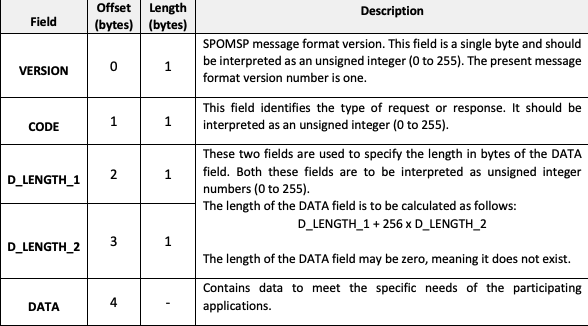

# US1901
=======================================

# 1. Requirements

**US1901** - As Project Manager, I want that the "OrdersServer" component supports properly, at request, the needs of the "CustomerApp" application.
___
The Order Server should provide it's functionalities according to the application protocol already defined, namely, the SPOMS Application Protocol. The SPOMS application protocol is defined in this [link.](https://moodle.isep.ipp.pt/pluginfile.php/201266/mod_resource/content/2/LEI-2021-22-Sem4-Project_v1-CommunicationProtocol.pdf)

The OrderServer should make use of concurrent mechanisms (e.g. threads) and state sharing between these mechanisms in order to handle multiple concurrent clients to the Order Server server.

In accordance with the SPOMS application protocol, each SPOMS network packet must oblidge to the following rules:

The SPOMS Packet has a packet header size of 4 bytes and the 4 bytes contain the following responsabilities:

The overall packet data length must be calculated by the formula: D_LENGTH_1 + 256 * D_LENGTH_2

The OrderServer should also be able to handle requests originating from the AGV Digital Twin, from the BackOffice application and other possible clients.
____

# 2. Analysis
The Order Server is a core compoment within the SPOMS project due to the fact that the Order Server is the bridge between the communication from all SPOMS applications and the AGV's. Also, since the AGV 
Manager has to implement the SPOMS Application Protocol, it's imperative that the Order Server lays the ground work for all the SPOMS Application Protocol implementations in other user stories.

## Programming Language
The SPOMS Application Protocol is based upon TCP sockets and as such it has a fair ammount of complexity to it. According to what has already being taught in RCOMP classes, two different programming languagues can be used: C or Java.

Using C allows for a more detailed low level control of the socket and also the overall raw network packages due to the low level nature of C. This low level nature of C allows the students to have a more powerfull codebase because they can have a more fine grained control of the TCP socket but this comes with it's set of disavantages. The main disavantages is that C is not a very productive language, meaning, it does not provide abstractions that facilitate the job of the developer and it also exposes the students to really high levels of detail in terms of network knowledge, which slows down the overall productive rate of the students. On the other hand, Java provides out of the box abstractions to handle with TCP sockets, which helps the students to speed up their development process and facilitates the usage of TCP sockets.

Java was the chosen language to use on the Order Server due to previously mentioned advantages.

## Multiple client handling
A key aspect of the Order Server is that it has to handle multiple clients and manage multiple clients sessions. One possible way to solve this issue is to use concurrency mechanisms(e.g threads) to ensure that each client is handled in an isolated manner and that the server can create/handle a pool of clients with ease.

## Answering requests from different clients
The Order Server needs to be able to handle requests that originate from different sources with each source of request having different objectives in mind, as such, the Order Server should implement different "request handling strategies" for each request it receives, as such, the Order Server should implement the **Strategy pattern** for each request it has to handle.

## SPOMS Application Protocol
Since the Order Server will be the first component to implement the SPOMS Application Protocol, it's imperative that the SPOMS Application Protocol implementation is done in such a way that allows the reusability of the implementation in other components. 

In order to reach this reusability of the implementation in other components, it's necessary to define a set of very simple facades of consumption.

### SPOMS Application Protocol Facade
The SPOMS Application Protocol should implement an easy to consume facade that exposes the following 3 sub-systems/resources:

**GetResponse** => Allows the client of the facade to obtain a response to the a specific request.

**Publish** => Allows the client of the facade to publish a message to the socket and not wait for a specific response.

**Subscribe** => Allows the client of the facade to subscribe for notifications for incoming SPOMS network packets.

The subscribe method should be an implementation of the **Observer Pattern**, as such, a contract named **SpomsPacketListener** should be defined in order to define the contract for each SPOMS network packet observer.

### Error Handling
The expected failed scenarios for this user story are the following:
- The client cannot connect to the Order Server. The handling of this error should be done on the client side.
- The client drops connection abruptly. The Order Server should identify a client connection that drops abruply and the client should be removed from the connected client's list.
- The Order Server cannot handle the request in a timely manner. There should a request re-try mechanism implemented in order to allow the re-tries of the same request.

### Application Engineering
The developed code should follow an approach where there is a clear separation of concerns within the application and a clear division of responsibilities for each developed class, meaning, there should be a clear separation between the code that is meant to handle the SPOMS Application Protocol and the code that is meant to handle each Order Server client request. 
In order to adhere to the previous statement the approach taken consisted of employing the following layers for the developed code:

**SPOMS Application Protocol Facade Layer**: The facade layer should expose an easy to consume facade that allows it's clients to easily communicate over the network using the SPOMS Application Protocol. 

**SPOMS Sender Layer**: The Sender layer should expose the necessary functionality to send a SPOMS Packet over the network.

**SPOMS Receiver Layer**: The receiver layer should expose the necessary functionality to allow a client to be notified whenever a SPOMS Packet arrives over the network. The SPOMS Receiver Layer should also implement the Observer pattern in order to notify it's listeners that a SPOMS network packet as arrived.

**SPOMS Parsing Layer**: The parsing layer should expose the necessary functionality to parse between a raw network packet to it's Java object representation and between a Java object representation of the network packet to a raw network packet. The parsing layer should also implement all the SPOMS Application Protocol business logic regarding the network packet header, meaning, making sure the correct bytes are at the correct place.

**Model Layer**: The model layer should expose a SPOMS Packet model that models a raw network packet that adheres to the SPOMS Application Protocol and the model layer should also expose the payloads to be used between all parties envolved on a SPOMS Application protocol communication.

**Strategy Pattern Layer**: The strategy pattern layer should expose the correct strategies to handle each specific request that originats from a client.

This layered approach helps to adhere to vital SOLID principles such as the Single Responsibility Principle and Open Closed Principle.

# 3. Design

## 3.1. Realization of Functionality
The following sequence diagrams displays the interaction between the system and it's clients:

**Sequence Diagram**:

The following Sequence Diagram displays how an Order Server handles requests from a client that arrive from the network:

### Handling client requests

### Adding a new client and handling client requests
The following Sequence Diagram displays how the Order Server adds a new client and how it handles new requests from that client:

### Dealing the multiple clients and concurrency:

## 3.2. Class Diagram
In order to make the different layers of the application loosely coupled a set of interfaces was defined to make sure that the dependencies between layers were upon abstractions and not actual concrete implementations. The defined interfaces were: SpomsCommunications, SpomsSender, SpomsReceiver, SpomsParser, SpomsPacketListener, OrderServerStrategyFactory and OrderServerStrategy. 

### Strategy Pattern

### Order Server

## 3.3. Software Patterns

### Layered architecture
As alreayd mentioned on other sections of this document and also the previously displayed class diagram, a well thought out layered approach was followed for the development of this feature. Five layers were developed with concrete responsibilities in mind:

**SPOMS Application Protocol Facade Layer**: The facade layer is responsible for providing functionalities to communicate over the network by using the SPOMS Application Protocol

**SPOMS Sender Layer**: The Sender layer is responsible for sending SPOM Packets over the network.

**SPOMS Receiver Layer**: The receiver layer is responsible for receiving SPOMS Packets that arive over the network and notify it's listeners.

**SPOMS Parsing Layer**: The parsing layer is responsible for converting packets from programming languague objects and raw network packets.

**Model Layer**: The model layer is responsible for modeling the payloads that will be sent over the network.

**Strategy Pattern Layer**: The strategy pattern is responsible for employing the correct strategie for each specific request.

### SOLID Principles
According to the class diagrams displayed and also the explanations provided in the Design section we can infer that the following SOLID principles were employed in the developed of this feature:

**Single Responsibility Principle**: Each developed class has a specific purpose attributed to it and a specific responsibility assigned to it. This can also be inferred from the very small set of methods provided by each class.

**Open/Closed Principle**: Each developed class can be further extended but cannot be modified as its behavior is strictly defined and well outlined.

**Interface Segregation Principle**: Each defined interface is really small in size and very specific which adheres to the principle of Interface Segregation from SOLID.

**Dependency Inversion Principle**: Dependencies between modules are bound by the abstractions created by the interfaces and not by actual concrete implementations, which adhere to the principle of dependency inversion from SOLID.

### Explicit dependencies
From the class diagram, one can infer that each class has a constructor explicitly defining the dependencies that the class needs in order to perform its operations which is considered to a good practice to follow since it makes it transparent to the consumer of the class which is the dependencies of the consumed class. 

The usage of explicit dependencies also helps with unit testing since it allows for "injected" mocked versions of the dependencies which can be manipulated and leveraged in order to create unit tests with the dependencies isolated from the class to be tested.

### Interfaces
One can infer from the class diagram that interfaces were defined and used during the development of this feature. The usage of these interfaces makes the codebase more coherent and promotes well-defined responsibilities. Interfaces were also used to make sure that the different modules of the developed code can depend upon abstractions and not actual concrete implementations. The usage of interfaces also made it easier and improved the created unit tests, since the usage of dependencies through interfaces allows the usage of mocks in order to isolate dependencies from the classes being tested.

## 3.4. Tests 

    N/A

# 4. Implementation

Implementation of the user story went according to the plan and the analysis described on this document.

Set os tasks deefined for this user story:

## Tasks

# 5. Integration/Demonstration

During the development of this feature, an effort has been made to make sure the developed code could be reused in other user stories for this sprint such as the user story US4001. To make sure that code was reusable, an effort was made to make sure the code was as much modular as possible so that different modules could be implemented in other stories, such as the ProductCategoryRepository module for example.

# 6. Observations
None

