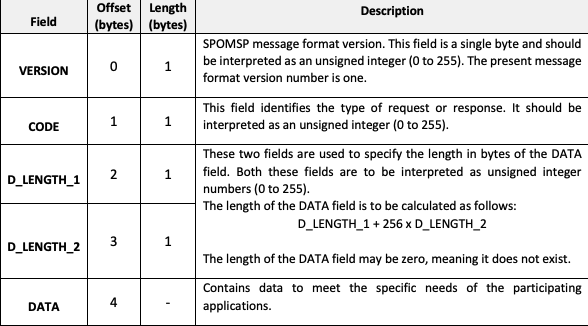
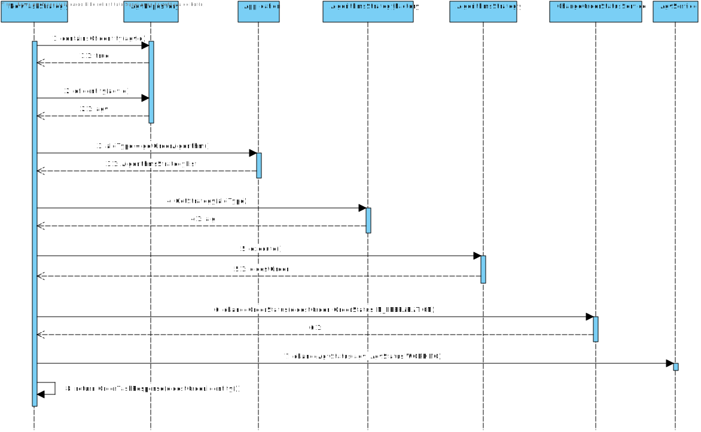
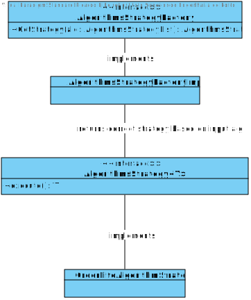
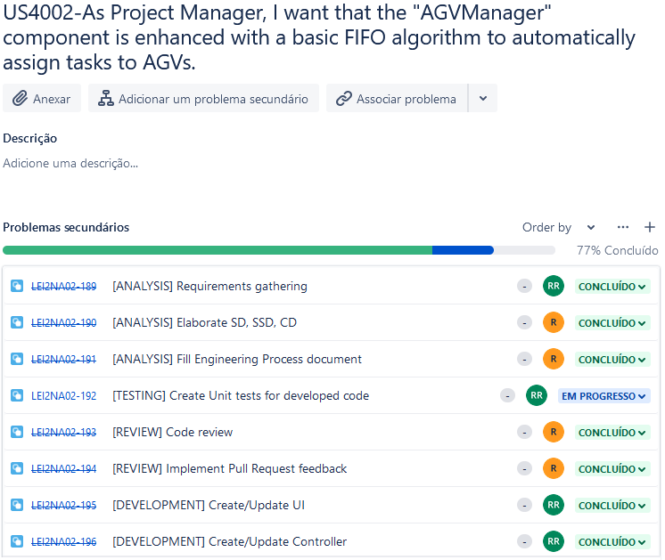

# US4002
=======================================

# 1. Requirements

**US4002** - As Project Manager, I want that the "AGVManager" component is enhanced with a basic FIFO algorithm to automatically assign tasks to AGVs.
___
The AGV Manager should provide it's functionalities according to the application protocol already defined, namely, the SPOMS Application Protocol. The SPOMS application protocol is defined in this [link.](https://moodle.isep.ipp.pt/pluginfile.php/201266/mod_resource/content/2/LEI-2021-22-Sem4-Project_v1-CommunicationProtocol.pdf)

The AGV Manager should make use of concurrent mechanisms (e.g. threads) and state sharing between these mechanisms in order to handle multiple concurrent clients to the AGV Manager server.

In accordance with the SPOMS application protocol, each SPOMS network packet must oblidge to the following rules:

The SPOMS Packet has a packet header size of 4 bytes and the 4 bytes contain the following responsabilities:

The overall packet data length must be calculated by the formula: D_LENGTH_1 + 256 * D_LENGTH_2

The AGV Manager should also be able to handle requests originating from the AGV Digital Twin, from the BackOffice application and other possible clients.
____

# 2. Analysis
The AGV Manager is a core compoment within the SPOMS project due to the fact that the AGV Manager is the bridge between the communication from all SPOMS applications and the AGV's. Also, since the AGV 
Manager has to implement the SPOMS Application Protocol, it's imperative that the AGV Manager lays the ground work for all the SPOMS Application Protocol implementations in other user stories.

### Application Engineering
The developed code should follow an approach where there is a clear separation of concerns within the application and a clear division of responsibilities for each developed class, meaning, there should be a clear separation between the code that is meant to handle the SPOMS Application Protocol and the code that is meant to handle each AGV Manager client request. 
In order to adhere to the previous statement the approach taken consisted of employing the following layers for the developed code:

**SPOMS Application Protocol Facade Layer**: The facade layer should expose an easy to consume facade that allows it's clients to easily communicate over the network using the SPOMS Application Protocol. 

**SPOMS Sender Layer**: The Sender layer should expose the necessary functionality to send a SPOMS Packet over the network.

**SPOMS Receiver Layer**: The receiver layer should expose the necessary functionality to allow a client to be notified whenever a SPOMS Packet arrives over the network. The SPOMS Receiver Layer should also implement the Observer pattern in order to notify it's listeners that a SPOMS network packet as arrived.

**SPOMS Parsing Layer**: The parsing layer should expose the necessary functionality to parse between a raw network packet to it's Java object representation and between a Java object representation of the network packet to a raw network packet. The parsing layer should also implement all the SPOMS Application Protocol business logic regarding the network packet header, meaning, making sure the correct bytes are at the correct place.

**Model Layer**: The model layer should expose a SPOMS Packet model that models a raw network packet that adheres to the SPOMS Application Protocol and the model layer should also expose the payloads to be used between all parties involved on a SPOMS Application protocol communication.

**Strategy Pattern Layer**: The strategy pattern layer should expose the correct strategies to handle each specific request that originate from a client.

This layered approach helps to adhere to vital SOLID principles such as the Single Responsibility Principle and Open Closed Principle.

# 3. Design

## 3.1. Realization of Functionality

**Sequence Diagram**:

The following sequence diagram only displays the interaction between the NewTaskStrategy and the actual implementation of such Strategy. All the details related to how the SPOMS Network Packet arrives are omitted to simplify the understanding to the viewer:

## 3.2. Class Diagram
In order to make the different layers of the application loosely coupled a set of interfaces was defined to make sure that the dependencies between layers were upon abstractions and not actual concrete implementations. The defined interfaces were: SpomsCommunications, SpomsSender, SpomsReceiver, SpomsParser, SpomsPacketListener, AGVManagerStrategyFactory and AGVManagerStrategy. 

### Strategy Pattern

## 3.3. Software Patterns

### Layered architecture
As alreayd mentioned on other sections of this document and also the previously displayed class diagram, a well thought out layered approach was followed for the development of this feature. Five layers were developed with concrete responsibilities in mind:

**Model Layer**: The model layer is responsible for modeling the payloads that will be sent over the network.

**Strategy Pattern Layer**: The strategy pattern is responsible for employing the correct strategie for each specific request.

### SOLID Principles
According to the class diagrams displayed and also the explanations provided in the Design section we can infer that the following SOLID principles were employed in the developed of this feature:

**Single Responsibility Principle**: Each developed class has a specific purpose attributed to it and a specific responsibility assigned to it. This can also be inferred from the very small set of methods provided by each class.

**Open/Closed Principle**: Each developed class can be further extended but cannot be modified as its behavior is strictly defined and well outlined.

**Interface Segregation Principle**: Each defined interface is really small in size and very specific which adheres to the principle of Interface Segregation from SOLID.

**Dependency Inversion Principle**: Dependencies between modules are bound by the abstractions created by the interfaces and not by actual concrete implementations, which adhere to the principle of dependency inversion from SOLID.

### Explicit dependencies
From the class diagram, one can infer that each class has a constructor explicitly defining the dependencies that the class needs in order to perform its operations which is considered to a good practice to follow since it makes it transparent to the consumer of the class which is the dependencies of the consumed class. 

The usage of explicit dependencies also helps with unit testing since it allows for "injected" mocked versions of the dependencies which can be manipulated and leveraged in order to create unit tests with the dependencies isolated from the class to be tested.

### Interfaces
One can infer from the class diagram that interfaces were defined and used during the development of this feature. The usage of these interfaces makes the codebase more coherent and promotes well-defined responsibilities. Interfaces were also used to make sure that the different modules of the developed code can depend upon abstractions and not actual concrete implementations. The usage of interfaces also made it easier and improved the created unit tests, since the usage of dependencies through interfaces allows the usage of mocks in order to isolate dependencies from the classes being tested.

## 3.4. Tests 

    N/A

# 4. Implementation

Implementation of the user story went according to the plan and the analysis described on this document.

Set os tasks deefined for this user story:

## Tasks

# 5. Integration/Demonstration

During the development of this feature, an effort has been made to make sure the developed code could be reused in other user stories for this sprint such as the user story US4001. To make sure that code was reusable, an effort was made to make sure the code was as much modular as possible so that different modules could be implemented in other stories, such as the ProductCategoryRepository module for example.

# 6. Observations
None

