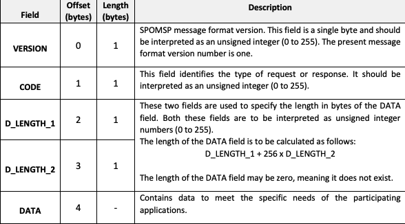
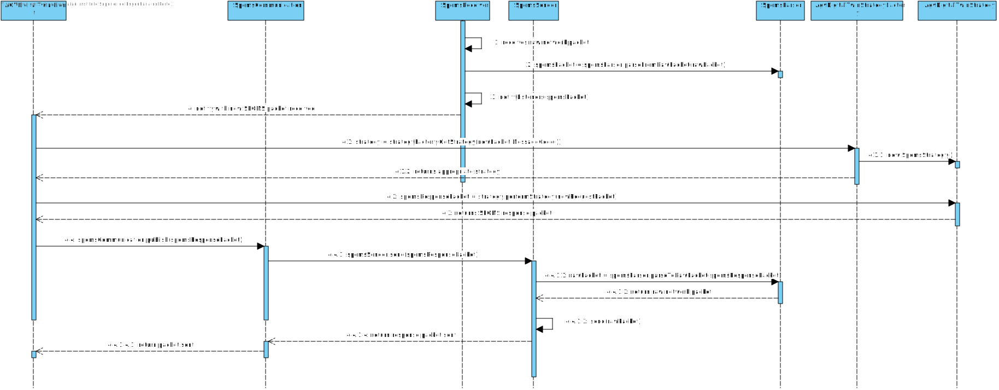
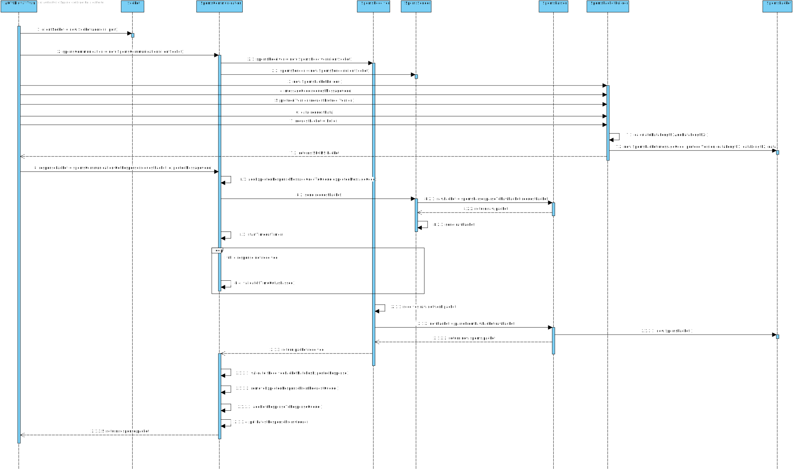
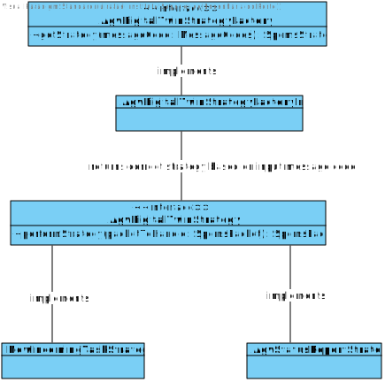
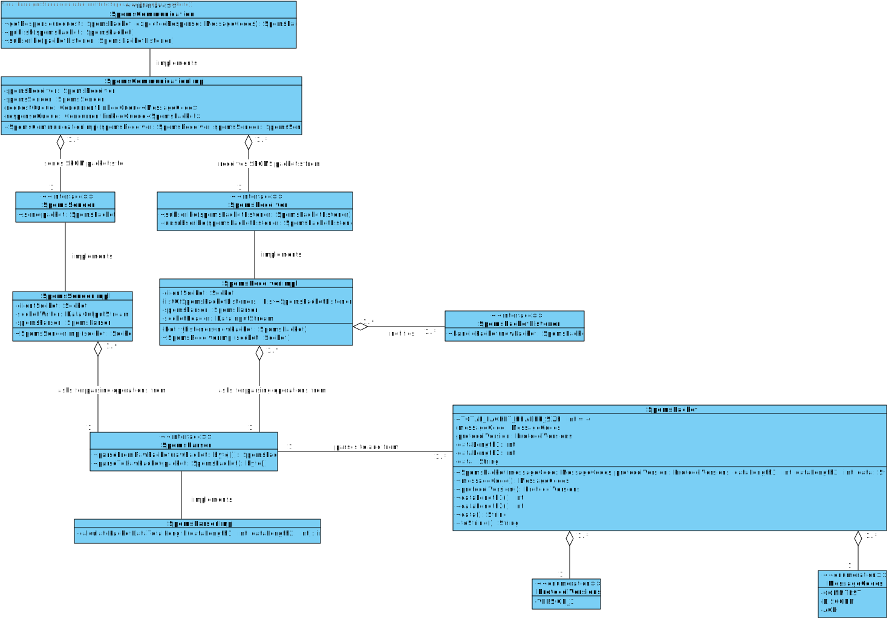
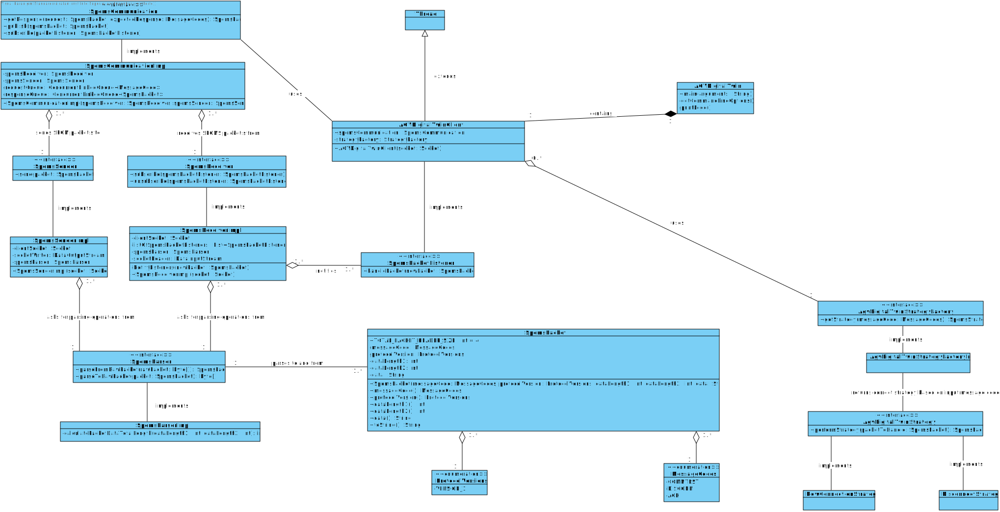
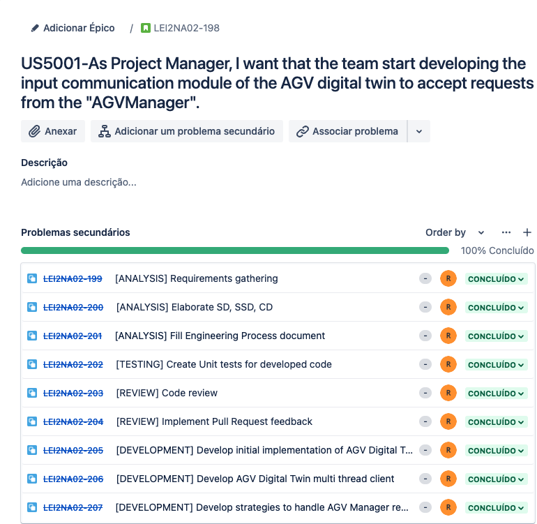

# US5001
=======================================

# 1. Requirements

**US5001** - As Project Manager, I want that the team start developing the input communication module of the AGV digital twin to accept requests from the "AGVManager".
___

The AGV Digital Twin should act as a client to AGV Manager it should also be able to communicate through the SPOMS Application Protocol. The SPOMS application protocol is defined in this [link.](https://moodle.isep.ipp.pt/pluginfile.php/201266/mod_resource/content/2/LEI-2021-22-Sem4-Project_v1-CommunicationProtocol.pdf)

The AGV Digital Twin has to able to answer requests from the AGV Manager and he must also be able to place requests to the AGV Manager.

In accordance with the SPOMS application protocol, each SPOMS network packet must oblidge to the following rules:

The SPOMS Packet has a packet header size of 4 bytes and the 4 bytes contain the following responsabilities:

The overall packet data length must be calculated by the formula: D_LENGTH_1 + 256 * D_LENGTH_2

____

# 2. Analysis
The AGV Digital Twin is one of the clients of the AGV Manager and it needs to communicate with the AGV Manager by using the SPOMS Application Protocol. The implementation of the SPOMS Application Protocol should be re-used by the module developed by the AGV Manager called "spoms.protocol".

## Programming Language
The SPOMS Application Protocol is based upon TCP sockets and as such it has a fair ammount of complexity to it. According to what has already being taught in RCOMP classes, two different programming languagues can be used: C or Java.

Using C allows for a more detailed low level control of the socket and also the overall raw network packages due to the low level nature of C. This low level nature of C allows the students to have a more powerfull codebase because they can have a more fine grained control of the TCP socket but this comes with it's set of disavantages. The main disavantages is that C is not a very productive language, meaning, it does not provide abstractions that facilitate the job of the developer and it also exposes the students to really high levels of detail in terms of network knowledge, which slows down the overall productive rate of the students. On the other hand, Java provides out of the box abstractions to handle with TCP sockets, which helps the students to speed up their development process and facilitates the usage of TCP sockets.

Java was the chosen language to use on the AGV Digital Twin due to previously mentioned advantages.

## Multi-threaded client
The AGV Digital Twin should perform as a multi-threaded client in order to make sure that the AGV Digital Twin is able to answer requests that arise over the network and also provide at the same time a menu that allows execution of commands on demand like: "PERFORM A COMMUNICATION CHECK WITH THE AGV MANAGER". 

## Answering different requests from AGV Manager
The AGV Digital Twin needs to be able to handle different requests that originate from AGV Manager with each request having different objectives in mind. This means that the AGV Digital Twin should implement different "request handling strategies" for each request it receives, as such, the AGV Digital Twin should implement the **Strategy pattern** for each request it has to handle.

## SPOMS Application Protocol
Since the AGV Digital Twin will re-use the "spoms.protocol" component, which implements the SPOMS Application Protocol, it's imperative to make use of the facade provided by the "spoms.protocol" components.

### SPOMS Application Protocol Facade
The SPOMS Application Protocol implements an easy to consume facade that exposes the following 3 sub-systems/resources:

**GetResponse** => Allows the client of the facade to obtain a response to the a specific request.

**Publish** => Allows the client of the facade to publish a message to the socket and not wait for a specific response.

**Subscribe** => Allows the client of the facade to subscribe for notifications for incoming SPOMS network packets.

The subscribe method is an implementation of the **Observer Pattern**, as such, a contract named **SpomsPacketListener** is defined in order for a listener to be notified whenever a SPOMS network packet arives over the network.

### Error Handling
The expected failed scenarios for this user story are the following:
- The client cannot connect to the AGV Manager. The handling of this error is done by the AGV Digital Twin and it should display an error message on the screen.
- An on-demand request from the AGV Digital Twin fails when trying to get a response from the AGV Manager. The handling of this error consists in showing an error message in the console.

### Application Engineering

The developed code should allow an approach where there is a clear separation of concerns within the application and a clear division of responsibilities for each developed class, meaning, there should be a clear separation between the code that is meant to handle the SPOMS Application Protocol and the code that is meant to handle each AGV Manager request. 

In order to adhere to the previous statement the approach taken was to use the component "spoms.protocol" that was implemented by the AGV Manager and make use of it's facade. 

In order to respond to every request that arises from the AGV Manager the AGV Digital Twin employs the strategy pattern, which clearly defines different strategies to be used in different requests, and as such, there is a "Strattegy Pattern Layer":

**Strategy Pattern Layer**: The strategy pattern layer should expose the correct strategies to handle each specific request that originates from the AGV Manager.

This layered approach helps to adhere to vital SOLID principles such as the Single Responsibility Principle and Open Closed Principle.

# 3. Design

## 3.1. Realization of Functionality
The following sequence diagrams displays the interaction between the system and it's clients:

**Sequence Diagram**:

The following Sequence Diagram displays how an AGV Manager handles requests from a client that arrive from the network:

### Handling AGV Manager requests

### Performing a Request to the AGV Manager

## 3.2. Class Diagram

### Strategy Pattern

### SPOMS Application Protocol

### AGV Digital Twin

## 3.3. Software Patterns

###  Strategy Pattern
The strategy pattern was applied in this user story in order to make sure that the AGV Digital Twin was able to properly handle each different request that arises from the AGV Manager.

### SOLID Principles
According to the class diagrams displayed and also the explanations provided in the Design section we can infer that the following SOLID principles were employed in the developed of this feature:

**Single Responsibility Principle**: Each developed class has a specific purpose attributed to it and a specific responsibility assigned to it. This can also be inferred from the very small set of methods provided by each class.

**Open/Closed Principle**: Each developed class can be further extended but cannot be modified as its behavior is strictly defined and well outlined.

**Interface Segregation Principle**: Each defined interface is really small in size and very specific which adheres to the principle of Interface Segregation from SOLID.

**Dependency Inversion Principle**: Dependencies between modules are bound by the abstractions created by the interfaces and not by actual concrete implementations, which adhere to the principle of dependency inversion from SOLID.

### Explicit dependencies
From the class diagram, one can infer that each class has a constructor explicitly defining the dependencies that the class needs in order to perform its operations which is considered to a good practice to follow since it makes it transparent to the consumer of the class which is the dependencies of the consumed class. 

The usage of explicit dependencies also helps with unit testing since it allows for "injected" mocked versions of the dependencies which can be manipulated and leveraged in order to create unit tests with the dependencies isolated from the class to be tested.

### Interfaces
One can infer from the class diagram that interfaces were defined and used during the development of this feature. The usage of these interfaces makes the codebase more coherent and promotes well-defined responsibilities. Interfaces were also used to make sure that the different modules of the developed code can depend upon abstractions and not actual concrete implementations. The usage of interfaces also made it easier and improved the created unit tests, since the usage of dependencies through interfaces allows the usage of mocks in order to isolate dependencies from the classes being tested.

# 4. Implementation

Implementation of the user story went according to the plan and the analysis described on this document.

Set os tasks deefined for this user story:

## Tasks

# 5. Integration/Demonstration

During the development of this feature, an effort has been made to make sure the developed code could be reused in other user stories for this sprint such as the user story US1001. To make sure that code was reusable, an effort was made to make sure the code was as much modular as possible so that different modules could be implemented in other stories, such as the ProductCategoryRepository module for example.

# 6. Observations
None

