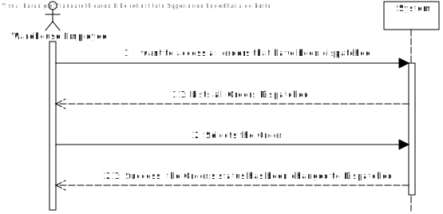
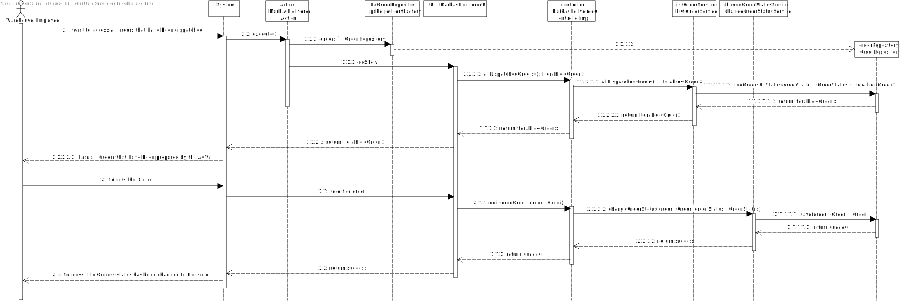
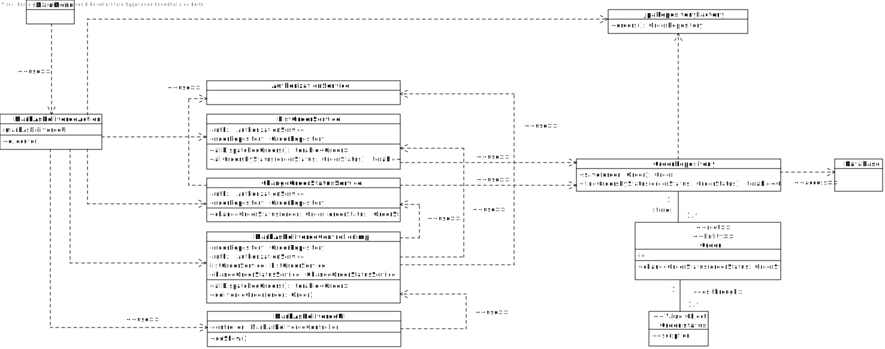
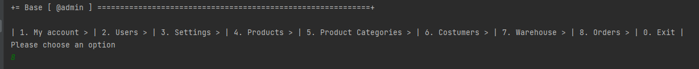
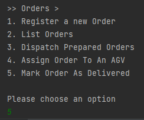
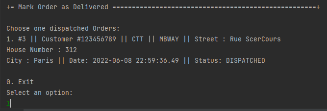
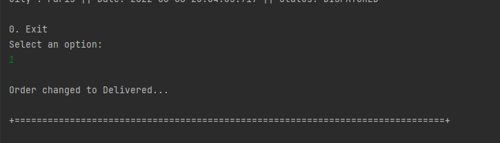
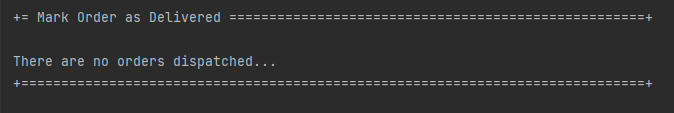
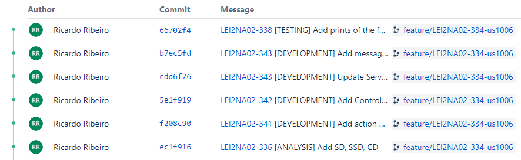
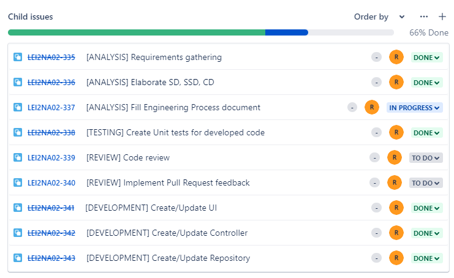

# US1006
=======================================

# 1. Requirements

**US1006** - As Sales Clerk, I want to access a list of orders that had been dispatched for customer delivery and be able to update some of those orders to as being delivered.
___
An Order's Status can assume various values: **"Another relevant aspect the system needs to track properly concerns the several states that every order goes by since it is registered in the system to the moment it is received by the customers. Some possible states that can be considered are: (i) registered, (ii) payment pending, (iii) to be prepared (waiting for an initial warehouse action), (iv) being prepared on the warehouse, (v) ready for packaging; (vi) ready for carrier dispatching, (vii) dispatched, (viii) delivered by carrier, (ix) received by
customer. Notice that all relevant states might not be listed and some of the listed states might be redundant and/or not necessary by some reason. As so, this matter should be carefully analyzed"**. 

Reference: [Specifications document section 2.1](https://moodle.isep.ipp.pt/pluginfile.php/201265/mod_resource/content/2/LEI-2021-22-Sem4-Project_v3-SystemDescription.pdf)
___

According to the requirements specified previously and also the context of the integrative project within EAPLI and LAPR4, the plan for the user story is the followning:

- Create a sub-menu within the main menu UI with the title "Mark Order As Delivered".
- Ask the user to select one dispatched order to mark as delivered.
- Change the status of the chosen Order to "Delivered".

# 2. Analysis
At first view, this User Story seems almost as simple as listing all of the dispatched orders and allowing the Warehouse Employee to change that status as Delivered. The main challenge here is that, since the change of a status could be done in different scenarios within different status', this User Story can be developed in a way that provides more generic tools for other User Stories that will need this type of functionality.

We had an approach, regarding Statuses, that is as pragmatic as one can be. Every e-commerce business with a warehouse management component will follow a well defined list of statuses that an order can go through. It does not make much sense that the available statuses will be changed any time after being defined in the beginning. Unless there is a major structural change in the business, an Order will always follow the same steps. Taking this in mind, we could have either gone for a JSON file with all the defined statuses or, to really simplify our work and the business' work, use an ENUM. That is what we have done.

The ones we have defined are the following:

## User interaction
### Menu Layout
To make sure that the user was able to easily interact with the functionality to list dispatched orders and Deliver one of those, the planned approach consisted in adding an item to an already existing sub-menu focused on Orders within the main menu with the title **Mark Order As Delivered**.

### Error Handling
The expected failed scenarios for this user story are the following:
- There are no dispatched orders at the moment

In this case, if there are no dispatched orders, none should be able for the User to choose from and in that case the User cannot advance.

## Domain concepts
According to the gathered requirements and also the user story specification, we could extract the following domain concepts:

### Entities
In this case, we are focusing on Orders. It is the main entity, we will focus on Orders and their statuses.

### Value Objects
The most import Value Object for this User Story is the Order's Order Status. 

**Value Objects**: OrderStatus

### Application Engineering
The developed code should follow an approach where there is a clear separation of concerns within the application and a clear division of responsibilities for each developed class, meaning, there should be a clear separation between the code that is meant to handle the User Interface, the code that is meant to handle the persistence of the orders and also the code that is meant to make sure the business rules are applied properly. 
In order to adhere to the previous statement the approach taken consisted of employing the following layers for the developed code:

**Action Layer**: The action layer is responsible for initiating the action necessary to display the correct user interface to the user so that the user can see all dispatched orders and choose one to Deliver.

**User Interface Layer**: The user interface layer is responsible for handling all the user inputs and all the interaction with the user.

**Controller Layer**: The controller layer is responsible for receiving the user input from the UI and performing the necessary operations that are needed to fulfill the user story.

**Service Layer**: The service layer is responsible for having the functionalities that most likely will be shared between User Stories. It is mostly useful to avoid code duplication.

**Persistence Layer**: The persistence layer is responsible for actually persisting the data that is meant to be persisted under the context of the user story.

**Domain Layer**: The domain layer is responsible for employing and enforcing all the business rules related to the Order and OrderStatus.

This layered approach helps to adhere to vital SOLID principles such as the Single Responsibility Principle and Open Closed Principle.

# 3. Design

## 3.1. Realization of Functionality
The following system sequence diagram displays the interaction between the user and the system:

**System Sequence Diagram**:

The following sequence diagram displays the interaction between all the developed components inherent to this user story:

**Sequence Diagram**:

## 3.2. Class Diagram
In order to make the different layers of the application loosely coupled a set of interfaces was defined to make sure that the dependencies between layers were upon abstractions and not actual concrete implementations. The defined interfaces were: MarkAsDeliveredController. 

The MarkAsDeliveredController interface defines the contract fulfilled by the controller or the supported operations by the controller layer.

## 3.3. Software Patterns

### Layered architecture
As already mentioned on other sections of this document and also the previously displayed class diagram, a well thought out layered approach was followed for the development of this feature. Five layers were developed with concrete responsibilities in mind:

**Action Layer**: The action layer is responsible for initiating the action necessary to display the correct user interface to the user so that the user can see all dispatched orders and choose one to dispatch.

**User Interface Layer**: The user interface layer is responsible for handling all the user inputs and all the interaction with the user.

**Controller Layer**: The controller layer is responsible for receiving the user input from the UI and performing the necessary operations that are needed to fulfill the user story.

**Service Layer**: The service layer is responsible for having the functionalities that most likely will be shared between User Stories. It is mostly useful to avoid code duplication.

**Persistence Layer**: The persistence layer is responsible for actually persisting the data that is meant to be persisted under the context of the user story.

**Domain Layer**: The domain layer is responsible for employing and enforcing all the business rules related to the Order and OrderStatus.

### SOLID Principles
According to the class diagrams displayed and also the explanations provided in the Design section we can infer that the following SOLID principles were employed in the developed of this feature:

**Single Responsibility Principle**: Each developed class has a specific purpose attributed to it and a specific responsibility assigned to it. This can also be inferred from the very small set of methods provided by each class.

**Open/Closed Principle**: Each developed class can be further extended but cannot be modified as its behavior is strictly defined and well outlined.

**Interface Segregation Principle**: Each defined interface is really small in size and very specific which adheres to the principle of Interface Segregation from SOLID.

**Dependency Inversion Principle**: Dependencies between modules are bound by the abstractions created by the interfaces and not by actual concrete implementations, which adhere to the principle of dependency inversion from SOLID.

### Explicit dependencies
From the class diagram, one can infer that each class has a constructor explicitly defining the dependencies that the class needs in order to perform its operations which is considered to a good practice to follow since it makes it transparent to the consumer of the class which is the dependencies of the consumed class. 

The usage of explicit dependencies also helps with unit testing since it allows for "injected" mocked versions of the dependencies which can be manipulated and leveraged in order to create unit tests with the dependencies isolated from the class to be tested.

### Interfaces
One can infer from the class diagram that interfaces were defined and used during the development of this feature. The usage of these interfaces makes the codebase more coherent and promotes well-defined responsibilities. Interfaces were also used to make sure that the different modules of the developed code can depend upon abstractions and not actual concrete implementations. The usage of interfaces also made it easier and improved the created unit tests, since the usage of dependencies through interfaces allows the usage of mocks in order to isolate dependencies from the classes being tested.

### Immutability
One can infer from the class diagram that each developed class has a single constructor with all the required dependencies and no setters defined. This promotes immutability within the codebase which also helps to have concrete and predictable behavior in the code that was developed.

## 3.4. Tests 

### Regular Unit Tests

For this type of functionality, we do not really have a way to Test Business Rules, per say.
The Order entity and the OrderStatus should already have their tests defined. 
In this case we have a listing functionality and a Value Object updating functionality.

So that this is not incomplete, we can test it ourselves. Our Database is already preloaded with some data, we have an order that are Dispatched (Or, in this case **DISPATCHED**) and we will dispatch Order Number #3:

We start by choosing the submenu Orders [8]:

We go into Mark Order As Delivered [5]:

It lists all of the orders that are Dispatched (as we can see, the status is **DISPATCHED**) and we will choose order number #3 [1]:

The system sends a message of success:

If there are no orders the system will show this message after step 2:

# 4. Implementation

Implementation of the user story went according to the plan and the analysis described on this document.

## Commits

## Tasks

# 5. Integration/Demonstration

During the development of this feature, an effort has been made to make sure the developed code could be reused in other user stories for this sprint. To make sure that code was reusable, an effort was made to make sure the code was as much modular as possible so that different modules could be implemented in other stories, such as the ChangeOrderStatusService module for example.

# 6. Observations
None

