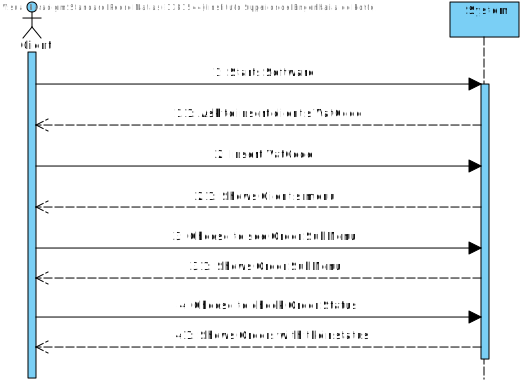
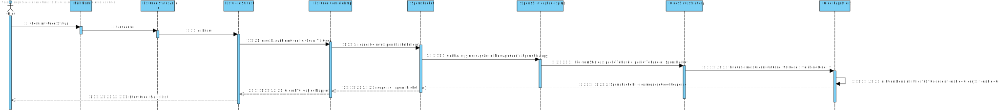
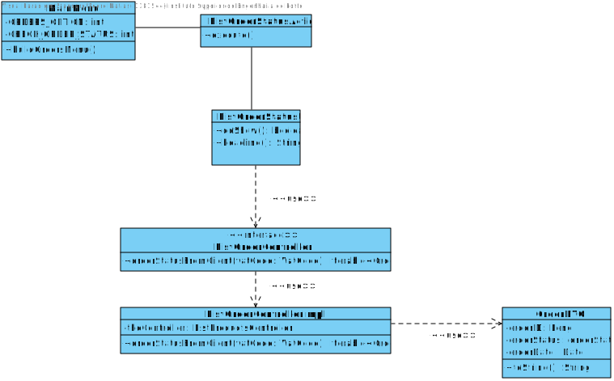
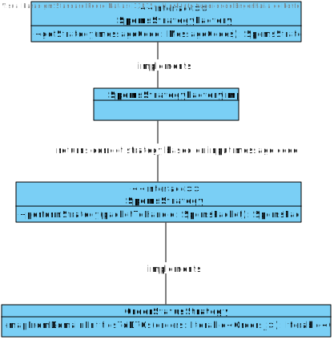
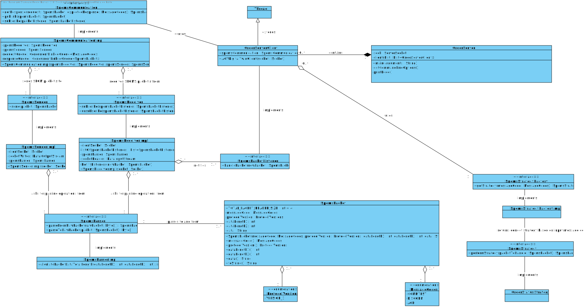
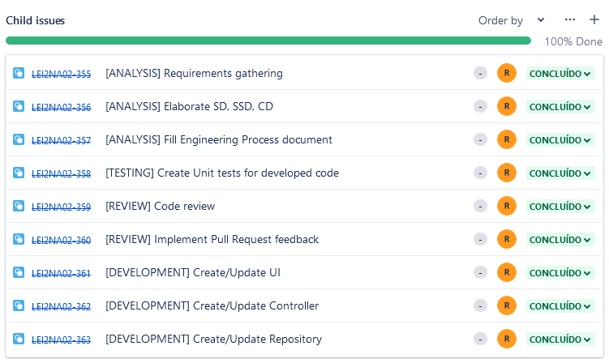
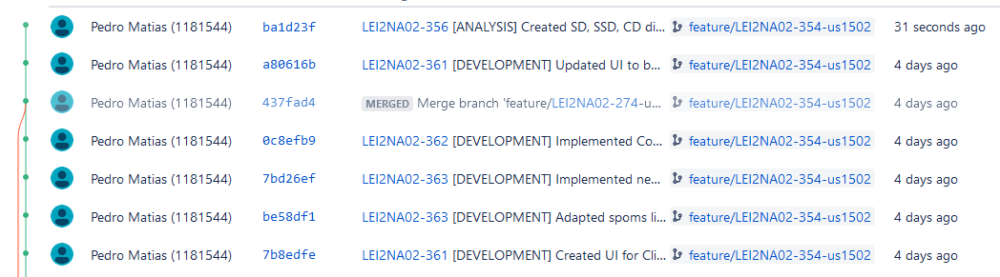

# US1502

# 1. Requirements

**US1501** - As Customer, I want to view/check the status of my open orders.
___
A Customer needs to be able to view the status of their orders registered in the system that haven't yet been delivered to the customer.
___

Question:
In the US 1502, it is asked to "view/check the status of my open orders", can you clarify if the open orders are all the orders that have been created or if it is orders with a specific status.

Answer:
It is all orders that have not been delivered to the customer yet.

Reference: [Forum Question](https://moodle.isep.ipp.pt/mod/forum/discuss.php?d=16984#p21770)
___

According to the requirements specified previously and also the context of the integrative project within EAPLI and LAPR4, the plan for the user story is the followning:

- Create a sub-menu within the main menu UI with the title "Order Options".
- Create a sub-menu within the sub-menu UI Order Options with the title "Check my order status".
- Create a UI with the information of the Client's orders that haven't yet been delivered to the customer.

# 2. Analysis
The analysis done for this user story was heavily influenced by the example project provided in the class of EAPLI. The example project can be found at this link: https://bitbucket.org/pag_isep/ecafeteria-base/src/master/

## User interaction
### Menu Layout
To make sure that the client was able to easily interact with the functionality to check his order's status, the planned approach consisted in creating a sub-menu within the main menu with the title **Orders**. The sub-menu **Check my order status** should be the one chosen in order to check the order status. 

### Error Handling
The expected failed scenarios for this user story are the following:
- No orders registred

In all of the above-mentioned failed scenarios, a user-friendly message needs to be displayed and specifying what caused the failure scenario.

## Domain concepts
According to the gathered requirements and also the user story specification, we could extract the following domain concepts:

### Value Objects
Since the implementation of this User Story only used already created Entities we didn't find the need to create further Value objectives, instead we used already existing ones in order to complete this feature.

### Application Engineering
The developed code should follow an approach where there is a clear separation of concerns within the application and a clear division of responsibilities for each developed class, meaning, there should be a clear separation between the code that is meant to handle the User Interface, the code that is meant to handle the persistence of the product categories and also the code that is meant to make sure the business rules are applied properly. 
In order to adhere to the previous statement the approach taken consisted of employing the following layers for the developed code:

**Action Layer**: The action layer is responsible for initiating the action necessary to display the correct user interface to the user so that the clerk can register a new customer.

**User Interface Layer**: The user interface layer is responsible for handling all the user inputs and all the interaction with the clerk.

**Controller Layer**: The controller layer is responsible for receiving the user input from the UI and performing the necessary operations that are needed to fulfill the user story.

This layered approach helps to adhere to vital SOLID principles such as the Single Responsibility Principle and Open Closed Principle.

# 3. Design

## 3.1. Realization of Functionality
The following system sequence diagram displays the interaction between the user and the system:

**System Sequence Diagram**:

The following sequence diagram displays the interaction between all the developed components inherent to this user story:

**Sequence Diagram**:

## 3.2. Class Diagram
In order to make the different layers of the application loosely coupled a set of interfaces was defined to make sure that the dependencies between layers were upon abstractions and not actual concrete implementations. 

With the intent to simplify the understanding of the feature we divided the Class Diagram in multiple with the following:

Even tho we didn't made changes to these parts of the system we find that to make it easier for the client to understand how our software works to include the following class diagram:

Order Server Class Diagram

## 3.3. Software Patterns

### Layered architecture
As alreayd mentioned on other sections of this document and also the previously displayed class diagram, a well thought out layered approach was followed for the development of this feature. Five layers were developed with concrete responsibilities in mind:

**Action Layer**: The action layer is responsible for initiating the action necessary to display the correct user interface to the clerk so that the user can register a new customer.

**User Interface Layer**: The user interface layer is responsible for handling all the user inputs and all the interaction with the user.

**Controller Layer**: The controller layer is responsible for receiving the user input from the UI and perform the necessary operations that are needed to fulfill the user story.

### SOLID Principles
According to the class diagrams displayed and also the explanations provided in the Design section we can infer that the following SOLID principles were employed in the developed of this feature:

**Single Responsibility Principle**: Each developed class has a specific purpose attributed to it and a specific responsibility assigned to it. This can also be inferred from the very small set of methods provided by each class.

**Open/Closed Principle**: Each developed class can be further extended but cannot be modified as its behavior is strictly defined and well outlined.

**Interface Segregation Principle**: Each defined interface is really small in size and very specific which adheres to the principle of Interface Segregation from SOLID.

### Interfaces
One can infer from the class diagram that interfaces were defined and used during the development of this feature. The usage of these interfaces makes the codebase more coherent and promotes well-defined responsibilities. Interfaces were also used to make sure that the different modules of the developed code can depend upon abstractions and not actual concrete implementations. The usage of interfaces also made it easier and improved the created unit tests, since the usage of dependencies through interfaces allows the usage of mocks in order to isolate dependencies from the classes being tested.

### Immutability
One can infer from the class diagram that each developed class has a single constructor with all the required dependencies and no setters defined. This promotes immutability within the codebase which also helps to have concrete and predictable behavior in the code that was developed.

## 3.4. Tests 

    @Test
    public void performStrategy_NullOrderStatus_ShouldReturnIllegalArgumentException(){
        // Act & Assert
        assertThrows(IllegalArgumentException.class, () -> orderStatusStrategy.PerformStrategy(null));
    }

### Business Logic

# 4. Implementation

Implementation of the user story went according to the plan and the analysis described on this document.

## Tasks

## Principal Commits List

# 5. Integration/Demonstration
N/A

# 6. Observations
None

