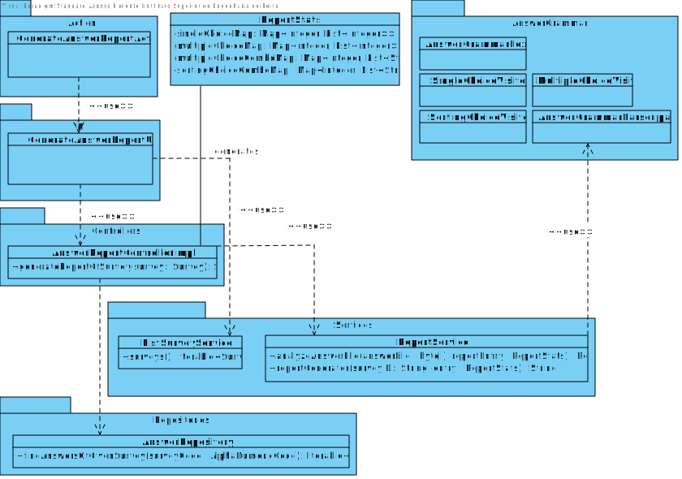
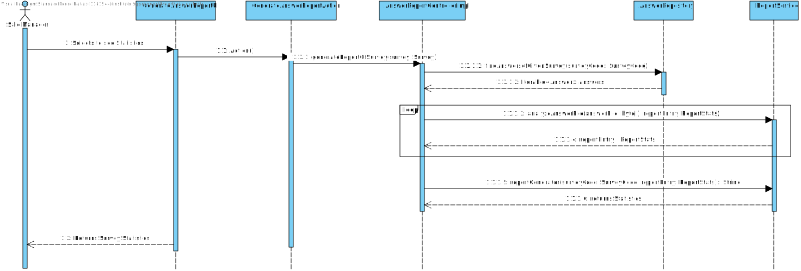
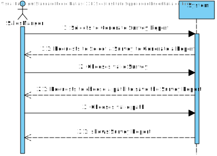

# US3002 - Generate a report of a given Survey's answers

This User Story comes in the segment of US3501 where it allows a Customer to answer a Survey.
Since the registration of the answers follows a certain pattern of writing in a file in order to parse it correctly, we should firstly analyze how each question/answer type translates into tokens:

### Simple text:

Question ID::
Answer;

Example:

"8::
I really like this product;"
_______________________________

### Single-Choice:

Question ID::
Option(Option text);

Example:

"9::
1(1-Gin);"
_______________________________

### Single-Choice with Input:

Question ID::
Option(Option text)%in%Input%in%;

Example:

10::
1(1-Gin)%in%Bombay Sapphire%in%;
_______________________________

### Multiple-Choice:

Question ID::
{Option(Option text),
Option(Option text),
etc.};

Example:

11::
{1(1-Gin),
2(2-Vodka),
3(3-Whisky)};
_______________________________

### Multiple-Choice with Input:

Question ID::
{Option(Option text),
Option(Option text),
etc.}
%in%Input Value%in%;

Example:

12::
{1(1-Gin),
2(2-Vodka),
3(3-Whisky)}
%in%With tonic water%in%;
_______________________________

### Sorting Options:

Question ID::
\#Option(Option text),
Option(Option text),
etc.#;

Example:

13::
\#1(1-Gin),
2(2-Vodka),
3(3-Whisky)#;
_______________________________

### Scaling Options:

Question ID::
%s%
Option(Option text)%so%Scale_option%so%
Option(Option text)%so%Scale_option%so%,
etc.
%s%;

Example:

14::
%s%
1(1-Gin tastes good)%so%Agree%so%,
2(2-Whisky tastes good)%so%Agree%so%,
3(3-Detox shake tastes good)%so%Strongly Disagree%so%
%s%
_______________________________

Given these examples, the grammar has been set in the following way:

### Defining a grammar called Answers

grammar AnswerGrammar;

answers : answer_Struct+EOF{1};

answer_Struct : (question_ID SEPARATOR answer);

question_ID : POSITIVE_NUMERIC;

answer : (single_Choice | single_Choice_With_Input | multiple_Choice | multiple_Choice_With_Input | sorting_Options | scaling_Options | simple_Answer);

### Type of answers

multiple_Choice : '{' multiple_Options '}';

multiple_Choice_With_Input : (multiple_Choice) (input_Answer);

sorting_Options : CARDINAL (multiple_Options) CARDINAL;

scaling_Options : SCALING_SEP ((scaling_Option) COMMA)+(scaling_Option) SCALING_SEP;

single_Choice : option;

single_Choice_With_Input : (single_Choice) (input_Answer);

simple_Answer : FREE_TEXT;

### Basis Answer Elements

multiple_Options : ((option)COMMA)+(option);

scaling_Option :  option SCALING_OP scale_Answer SCALING_OP;

scale_Answer : SCALE_VALUE;

input_Answer : INPUT_SEP simple_Answer INPUT_SEP;

option : (POSITIVE_NUMERIC '(' simple_Answer ')');

### Generic
POSITIVE_NUMERIC : [1-9]|(\[1-9]([0-9]+));

### Separators

CARDINAL : '#';

INPUT_SEP : '%in%';

SCALING_SEP : '%s%';

SCALING_OP : '%so%';

DOT : '.'-> skip;

DOT_COMMA : ';'-> skip;

COMMA : ',';

### Other Elements
SEPARATOR : '::';

NEWLINE: '\n' -> skip;

WS : ' '+ -> skip ;

APOSTROPHE : '\'' -> skip;

EQUAL : '=';

SPECIAL : [$&+=@|<>^*!];

HIFEN : '-';

SCALE_VALUE :  ('Strongly Agree' | 'Agree' | 'Neutral' | 'Disagree' | 'Strongly Disagree');

FREE_TEXT : (WORD | UPPERCASE_WORD | NAME | POSITIVE_NUMERIC | ZERO | WS | SPECIAL |APOSTROPHE | COMMA | HIFEN)+;

ZERO : '0';

NUMERIC : (('0'[1-9]) | (\[1-9]([0-9]+)))+;

WORD : [a-z]+;

NAME : [A-Z]{1}[a-z]+;

UPPERCASE_WORD : [A-Z]+;

__________________________________

# Process followed when generating the Report

The Antlr plugin and library allowed us to generate all of the basis of the parsing of the Grammar.
Nevertheless, we can not achieve the result only by using the generated classes, we have to create "Custom" visitors that have custom actions per each type of Context.

In the end, it identifies each type of answer. If it is a simple text answer, it will not analyze it.
If it is a single-choice, multiple-choice, is it with or without input, it will analyze it. So will the sorting type answers.

It will then generate a Report, print it on the console and on a file in a given path.

In order to test this correctly, first there must be Answers registered in the database.

One can answer a Survey on the BaseUserApp. It registers the answer and then the report can be generated on the BackofficeApp.

To check how this works, see the video Report.mp4.)

The mathematical part behind this is pretty simple. In single choices it will save the question ID as a Key and a list with counted choices per answer as Value.
In multiple choices it will do the same and also add the combination of the choices and also evaluate the frequency of that.

It is all about counting each time an answer or option is chosen, divide it by the total answers of a question and present it as a percentage.