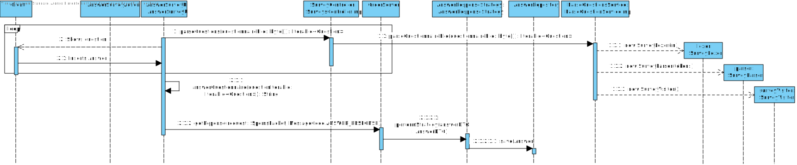
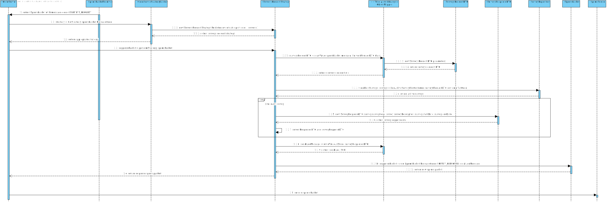

# US3501
=======================================

# 1. Requirements

**US3501** - As Customer, I want to get the list of questionnaires that the system is asking me to answer and be able to answer any of those questionnaires.
___
Can a customer answer the same survey multiple times? Or should he only be able to answer the survey once?: **"No"**. 

Reference: [Forum question](https://moodle.isep.ipp.pt/mod/forum/discuss.php?d=17164)
___

Dear client, 

 

Which of the following scenarios do you want for the action of determining the target audience of each survey/questionnaire:

 

Scenario 1: After a survey is created, the target audience for that survey is identified at the moment of the survey creation and cannot be extended in the future. Example: if a survey is created at the 1st of June and one of the rules for that survey is that a client must be of male gender than the target audience of that survey will be all the male customers registered up until the 1st of June. If a new male customer arises on the 2nd of June he will not be considered as a target audience of that survey.

 

 

Scenario 2: The target audience of each survey is constantly extended up until the end date of the survey/questionnaire. Example: if a survey is created at the 1st of June and it’s end date is at the 20th of June and one of the rules for that survey is that a client must be of male gender, than all existent male customers up until the 1st of June and all the clients with male gender that arise between the 1st of June and the 20th of June will also be eligible for that survey/questionnaire.

Thank you.

Answer:**In the scope of Sprint D, the first scenario is more than enough.**
____

# 2. Analysis
The analysis done for this user story was heavily influenced by the example project provided on the class of EAPLI. The example project can be found in this link: https://bitbucket.org/pag_isep/ecafeteria-base/src/master/

## User interaction
### Menu Layout
To make sure that the user was able to easily interact with the functionality to obtain the availabel surveys to answer and to establish the initial base menu for all potential user stories related to surveys, the planned approached consisted in creating a sub-menu within the main-menu with the title **Surveys**. The sub-menu **Surveys** should also display all the available functionalities related to surveys in a drop-down list that contains the following functionalities: list surveys and answer survey.

### Error Handling
The expected failed scenarios for this user story are the following:
- No surveys were found for the user.
- Misformed answer for a specific question.

In all of the above mentioned failed scenarios a user friendly message needs to be displayed and specifying exactly what caused the failed scenario.

## Domain concepts
According to gathered requirements and also the user story specification we could extract the following domain concepts:

### Entities
From the user story and the project specification we can extract the logical consequence that the system/application should be able to manage multiple surveys with each survey having it's own unique identity hence on our system a Survey entity needs to exist.

The surveys must have a "target audience" which essentially means that there should be customers associated with each survey and the surveys associated with each survey are the target audience of that specific survey, as such, there must be a many-to-many relationship between surveys and customers.

When the customer wants to answer a Survey that he is able to answer, the questionnaire file "fit inside" a Survey is parsed and then displayed to the User.
It displays each question in a row and collects each answer, is it a simple text, single-choice, multiple-choice, etc., in the wanted format.

It builds a continuous String with every answer in a way established in our grammar, as one can see in the EngineeringProcess of User Story 3002.
The format should build our defined rules otherwise it will fail.

**Entities**: Survey, Answer and Customer.

### Value Objects
According to the gathered requirements regarding the composition of the surveys, the following value objects were defined:

**Value Objects**: SurveyRule, AlphaNumericCode and Description.

### Domain Exceptions
Due to the complicated logic associated with the surveys there was a need to create a specific Domain exception that is used whenever a business logic error occurs that is related to the surveys.

***Domain Exceptions***: SurveyException.

### Application Engineering
The developed code should follow an approach where there is a clear separation of concerns within the application and a clear division of responsibilities for each developed class, meaning, there should be a clear separation between the code that is meant to handle the User Interface, the code that is meant to handle the persistence of the product categories and also the code that is meant to make sure the business rules are applied properly. 
In order to adhere to the previous statement the approach taken consisted of employing the following layers for the developed code:

**Action Layer**: The action layer is responsibile for initating the action necessary to display the correct user interface to the user so that the user can register a new Survey.

**User Interface Layer**: The user interface layer is responsible for handling all the user input's and all the interaction with the user.

**Controller Layer**: The controller layer is responsible for receiving the user input's from the UI and perform the necessary operations that are needed to fullfill the user story.

**Service Layer**: The service layer is responsible for hiding complex business logic related to the specific Domain Aggregates that it handles.

**Persistence Layer**: The persistance layer is responsible for actually persisting the data that is meant to be persisted under the context of the user story.

**Domain Layer**: The domain layer is responsible for employing and enforcing all the business rules related to surveys, e.g Survey code should not be empty and contain a maximum of 20 characters and a Survey cannot be created with no target audience defined.

This layered approach helps to adhere to vital SOLID principles such as the Single Responsability Principle and Open Closed Principle.

# 3. Design

## 3.1. Realization of Functionality
The following system sequence diagram displays the interaction between the user and the system:

**System Sequence Diagram**:

**System Sequence Diagram to register a Survey**

**System Sequence Diagram to answer a Survey**

The following sequence diagram displays the interaction between all the developed components inherent to this user story:

**Sequence Diagram for registering a survey**:

**Sequence Diagram for registering a survey by using the product period rule strategy**:

**Sequence Diagrams for answering a survey**:

**Sequence Diagrams for answering a survey and registering an answer**:

**Sequence Diagram for Order Server strategy to handle the request to get the customer surveys**:

**Sequence Diagram for Order Server strategy to handle the request to get a questionnaire for a specific survey**:

## 3.2. Class Diagram
In order to make the different layers of the application loosely coupled a set of interfaces were defined to make sure that the dependencies between layers were upon abstractions and not actual concrete implementations. The defined interfaces were: RegisterSurveyController, RegisterSurveyService, ListSurveysController, ListSurveysService, SurveysController, OrderRepository, CustomerRepository and SurveyRepository. 

The RegisterSurveyController, ListSurveysController and SurveysController interfaces define the contracts fulfilled by the controller or the supported operations by the controller layer.

The OrderRepository, CustomerRepository and SurveyRepository interfaces define the contracts fulfilled by the repository or the supported operations by the persistance layer. 

According to what was described in the analysis section, an entity and two value objects were created. The ProductCategory class represents the domain entity and the classes AlphaNumericCode and Description represent the domain value objects.

**Class Diagram related to the feature of creating a survey**

**Class Diagram related to the feature of answering a survey**

**Class Diagram for the Strategy Pattern implementation for the survey rules**

**Class Diagram for the Strategy Pattern implementation for the OrderServer handling of requeests**

## 3.3. Software Patterns

###  Strategy Pattern
The strategy pattern was applied in this user story in two different scenarios:

**Survey rules for the target audience**: Since each survey can have multiple rules that dictate the target audience of each survey, a decision was made to use the Strategy Pattern for each rule that is supported and can be applied to identify the target audience.

**Order Server handling of requests from the client application**: Since the OrderServer component must be able to answer different requests that arise from the client application, a decision was made to use the Strategy Pattern for each request that arises from the client application and is received by the OrderServer component.

### Layered architecture
As alreayd mentioned on other sections of this document and also the previously displayed class diagram, a well tought out layered approach was followed for the development of this feature. 5 layers were developed with concrete responsabilities in mind:

**Action Layer**: The action layer is responsibile for initating the action necessary to display the correct user interface to the user so that the user can register a new product category.

**User Interface Layer**: The user interface layer is responsible for handling all the user input's and all the interaction with the user.

**Controller Layer**: The controller layer is responsible for receiving the user input's from the UI and perform the necessary operations that are needed to fullfill the user story.

**Persistence Layer**: The persistance layer is responsible for actually persisting the data that is meant to be persisted under the context of the user story.

**Domain Layer**: The domain layer is responsible for employing and enforcing all the business rules related to the product category, e.g Alphanumeric code should not be empty and maximum of 20 characters.

### SOLID Principles
According to the class diagrams displayed and also the explanations provided in the Design section we can infer that the following SOLID principles were employed on the developed of this feature:

**Single Responsability Principle**: Each developed class has a specific purpose attributed to it and a specific responsability assigned to it. This can also be infered from the very small set of methods provided by each class.

**Open/Closed Principle**: Each developed class can be further extended but cannot be modified as it's behavior is strictly defined and well outlined.

**Interface Segregation Principle**: Each defined interface is really small in size and very specific which adheres to the principle of Interface Segregation from SOLID.

**Dependency Inversion Principle**: Dependencies between modules are bound by the abstractions created by the interfaces and not by actual concrete implementations, which adheres to the principle of dependency inversion from SOLID.

### Explicit dependencies
From the class diagram one can infer that each class has a constructor explicitly defining the dependencies that the class needs in order to perform it's operations which is considered to a good pratice to follow since it makes transparent to the consumer of the class which are the dependencies of the consumed class. 

The usage of explicit dependencies also helps with unit testing since it allows to "injected" mocked versions of the dependencies which can be manipulated and leveraged in order to create unit tests with the dependencies isolated from the class to be tested.

### Interfaces
One can infer from the class diagram that interfaces were defined and used during the development of this feature. The usage of these interfaces makes the codebase more coherent and promotes well defined responsibilities. Interfaces were also used to make sure that the different modules of the developed code can depend upon abstractions and not actual concrete implementations. The usage of interfaces also made it easier and improved the created unit tests, since the usage of dependencies through interfaces allows the usage of mocks in order to isolate dependencies from the classes being tested.

### Immutability
One can infer from the class diagram that each developed class has a single constructor with all the required dependencies and no setters defined. This promotes immutability within the codebase which also helps to have concrete and predictable behavior in the code that was developed.

## 3.4. Tests 

Unit tests were created for all the developed components for this user story.

# 4. Implementation

Implementation of the user story went according to the plan and the analysis described on this document.

## Commits

## Tasks

# 5. Integration/Demonstration

During the development of this feature an effort has been made to make sure the developed code could be reused in other user stories for this sprint such as the user story US1001. To make sure that code was reusable, an effort was made to make sure the code was as much modular as possible so that different modules could be implemented in other stories, such as the ProductCategoryRepository module for example.

# 6. Observations
None

