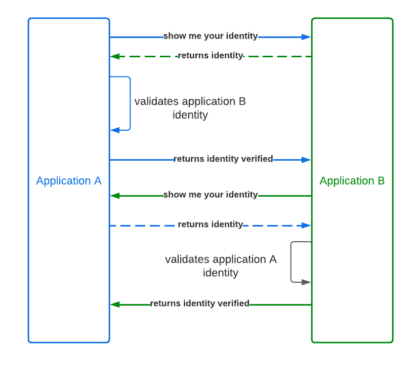
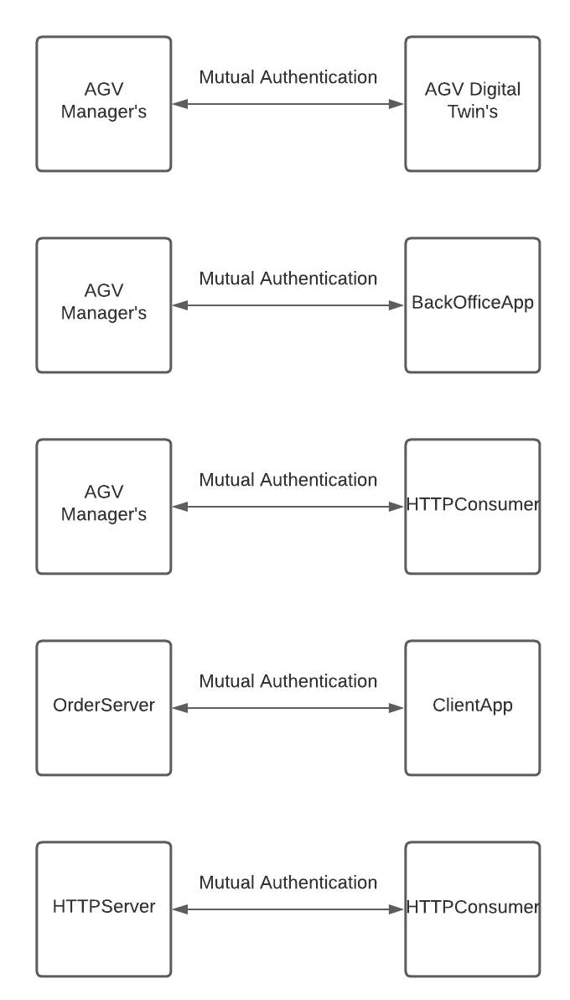
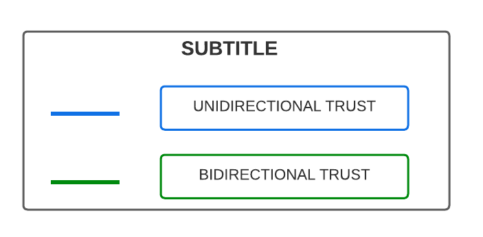
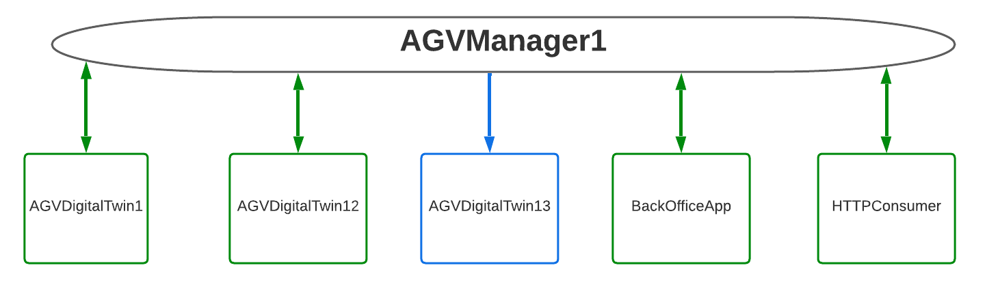
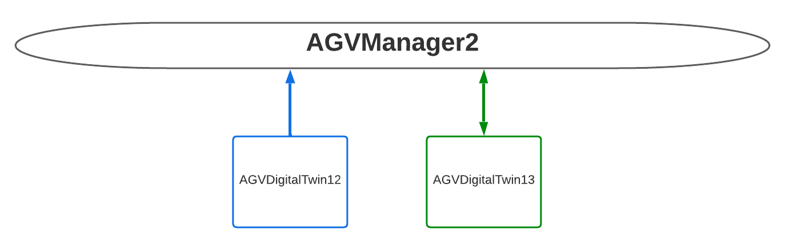
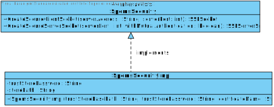
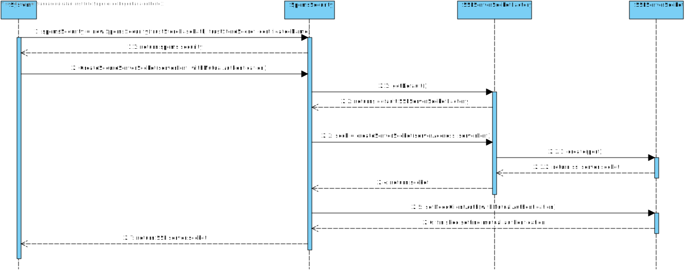
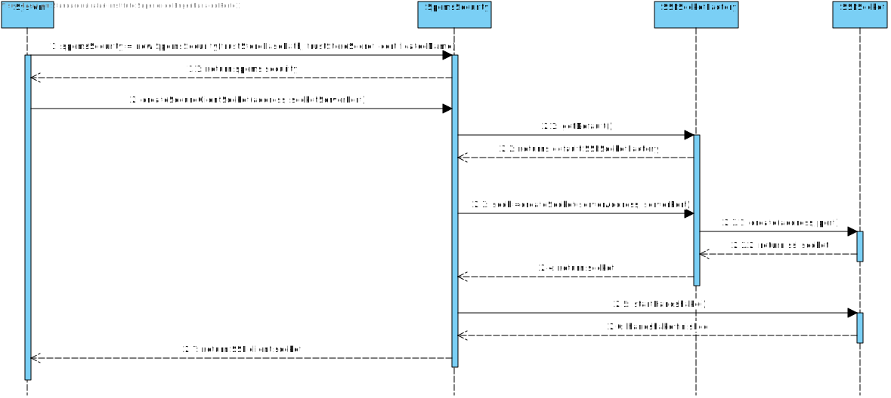

# SPOMS Security
In the context of the class RCOMP and also in the context of cyber security in general, communications between applications should/must be as secure as possible in order to prevent security breaches. Communications betweeen applications must adhere to the following security principles:

* Confidentiality
* Availability
* Integrity
* Authentication

One possible way to achieve the described security principles is by the enforcement of secure protocols like SSL/TLS/HTTPS and through the use of certificates. Certificates provide a way to prove someone's identity and also to initiate the chain of actions that protocols like SSL/TLS employ. Certificates can also be leveradge in order to enforce mutual authentication scenarios and by mutual authentication scenarios we are refering to scenarios where the two applications validate each other's identity.

In order to achieve the security requirements and to adhere to the security principles mentioned, during the development of the SPOMS project we decided to enforce security on every developed application through the use of certificates and protocols like SSL/TLS/HTTPS. Each application of SPOMS that needs to expose public resources or that needs to communicate to other applications must use one of those protocols and each application must also have it's own certificate.

## Mutual Authentication
In the context of the SPOMS project there are a set of applications that are predefined and that are authorized to make communications over the network and between each other. Due to this scenario, mutual authentication is vital to ensure the security of the SPOMS project. By mutual authentication we mean that in a communication scenario between two applications, one must validate the identity of the other application:

Mutual authentication is enforced between AGV Manager's and AGV Digital Twin's, AGVManager's and BackOfficeApp, between OrderServer and ClientApp and between HTTPServer and HTTPConsumer.

## Trust relationships between applications/certificates

In order to achieve security and correct identity validation between application instances, a set of trust relationships between certificates/applications was defined. For the sake of demonstration purposes we assumed that we would have 3 different instances of AGV Digital Twins and 2 different instances of AGV Managers.

## Trust stores

### Subtitle

)

### Trust store for AGV Manager 1

Disclaimer: For the sake of demonstration purposes, AGV Manager 1 does not have a mutual trust relationship between himself and AGV Digital Twin 13. AGV Digital Twin 13 does not trust AGV Manager 1. This is intended to demonstrate a scenario where the server trusts the client but the client does not trust the serever. This is intended to demonstrate the case where the SERVER trusts the CLIENT but the CLIENT does not trust the SERVER.

### Trust store for AGV Manager 2

Disclaimer: For the sake of demonstration purposes, AGV Manager 2 does not have a mutual trust relationship between himself and AGV Digital Twin 12. AGV Digital Twin 12 trusts AGV Manager 2 but AGV Manager 2 does not trust AGV Digital Twin 12. This is intended to demonstrate the case where a CLIENT trusts the SERVER but the SERVER does not trust the client.

### Trust store for Order Server

### Trust store for HTTP Server

## Class Diagrams

In order to make reusability of the code that initiates secure connections, an extra contract and class were defined for Spoms Security:

## Sequence Diagrams

### Initiating a secure server socket

### Initiating a secure client socket

