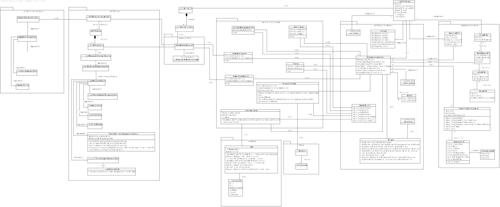

# US5100
=======================================

# 1. Requirements

**US5100** - As Project Manager, I want that the team to develop and integrate the others components/parts of the AGV digital twin (e.g.: movement, obstacle sensors, control unit).
___

Modules:

* Control System
* Sensor
* Positioning
* Communications
* Route Planner
* Simulation Engine
* Battery management system (BMS)


Reference: [SCOMP Integration Project Description](https://moodle.isep.ipp.pt/pluginfile.php/215651/mod_resource/content/1/SCOMP_PI_2022.pdf)
___

According to the requirements specified previously, the plan for the user story is the following:

- Create threads.
- Communicate between them.
- Drone needs to receive the order and pick the products and return.
- Drones can't collide.

# 2. Analysis

Given the US guidelines, it is required to implement modules for:
* ## Control System
    - Receives command to execute order
    - Generates route for order
    - Communicates with other modules through shared memory

**Justification**
A different aproach will be taken in the following:
* Will not Receive information about agv position on the shop floor, since the agv follows the path until it comes across an obstacle, then it recalculates its path
* Will not maintain a queue of orders to be executed, these will be stored in the shared memory SharedInformation

* ## Sensor

    - Will check the "world" around the agv in order to detect obstacles.

**Justification**
    
* A different aproach will be taken in the ammount of sensor, where instead of 8 sensors it will be used one to verify a set of positions next to the AGV (according to its direction) represented in the diagram below
```   
     +--+--+
     |  |  |
     +--+--+--+
    |agv|  |  |
     +--+--+--+
     |  |  |
     +--+--+
```

* ## Positioning
    - Calculates the position based on the AGV speed and direction
    - Reads speed from the SharedInformation

* ## Simulation engine

    - Collects information from all AGVs regarding their positions
    - Updates the AGVs positions on a given interval

**Justification** 
A different aproach will be taken for the following:
* Will not map the world, the world will be stored in the shared memory along with a list of other agv positions that represent other obstacles
* Will not transmit to sensors, since these already read the positions themselves

* ## Route Planer

    - Given a source and destination, generates a path (list of positions) for the AGV to follow

* ## Battery management system

    - Runs battery drainage routine
    - Monitors and transmits battery value
    - Calls "return to dock" routine on low battery


* ## SharedInformation (support)
To support the comunication between the threads, a shared memory(SharedInformation) with locked access will be used

- Holds the "world map"
- Maintains a queue of orders to be executed
- Holds a list of other AGV currently working (that represent an obstacle)
- Holds AGV speed
- Holds a Queue of routes to be generated

___


These Modules will be implemented as threads for an AgvDigitalTwin.

The threads to create are (follow link to sudo code):

* [Sensor](Sensor.md)
* [Positioning](Positioning.md)
* [Route Planner](RoutePlanner.md)
* [Control System](ControlSystem.md)
* [Communication](Communication.md)
* [Simulation Engine](SimulationEngine.md)
* [Battery Management System](BatteryManagementSystem.md)

# 3. Design

## 3.1. Realization of Functionality

**Sequence Diagram**:

The following sequence diagram displays the course of AGVDigitalTwin Application.


## 3.2. Class Diagram



## 3.4. Tests 

### Error Handling

Error Handling tests were created to ensure the secure flow of te application:

**Create Path Out of Bounds (BFSTest):** Check if position is out of the world bounds

    @Test
    void createPathOutofBounds() {

        int[][] world = new int[5][5];
        PositionDTO src = new PositionDTO(6L, 1L);
        PositionDTO dest = new PositionDTO(1L, 1L);

        assertThrows(NullPointerException.class, () -> {
            Stack<PositionDTO> path =  BFS.createPath(world, src, dest);
    }

**Get Route Out Of Bounds Position (RoutePlannerTest):** Check if the route is out of bound

    @Test
    void getRouteOutofboundsPosition() {

        WarehouseDTO wDto = new WarehouseDTO();
        wDto.length = 5;
        wDto.width = 5;
        wDto.docks = new ArrayList<DockDTO>();
        DockDTO dDto = new DockDTO();
        dDto.position = new PositionDTO();
        dDto.position.lSquare = 2L;
        dDto.position.wSquare = 5L;

        wDto.docks.add(dDto);

        SharedInformation si = new SharedInformation(wDto);

        assertThrows(NullPointerException.class, () -> {
            RoutePlanner rp = new RoutePlanner(si);
        });
    }

**Get Route Negative Position (RoutePlannerTest):** Check if the route as negative position

    @Test
    void getRouteNegativePosition() {

        WarehouseDTO wDto = new WarehouseDTO();
        wDto.length = 5;
        wDto.width = 5;
        wDto.docks = new ArrayList<DockDTO>();
        DockDTO dDto = new DockDTO();
        dDto.position = new PositionDTO();
        dDto.position.lSquare = 2L;
        dDto.position.wSquare = -1L;

        wDto.docks.add(dDto);

        SharedInformation si = new SharedInformation(wDto);

        assertThrows(NullPointerException.class, () -> {
            RoutePlanner rp = new RoutePlanner(si);
        });
    }  

### Unit Test

Unit Test tests were created to ensure that functions work write:

**Is Destination Not Equal (BFSTest):** Check if position is not destination

    @Test
    void isDestinationNotEqual() {

        PositionDTO dest = new PositionDTO(1L, 2L);
        int col = 1;
        int row = 3;

        assertFalse(BFS.isDestination(dest, row, col));
    }  

**Is Destination (BFSTest):** Check if position is destination

    @Test
    void isDestinationEqual() {

        PositionDTO dest = new PositionDTO(1L, 2L);
        int col = 1;
        int row = 2;

        assertTrue(BFS.isDestination(dest, row, col));
    } 

**Create Path Successfully (BFSTest):** Create a path

    @Test
    void createPathSuccess() {

        int[][] world = new int[5][5];
        PositionDTO src = new PositionDTO(1L, 1L);
        PositionDTO dest = new PositionDTO(2L, 2L);

        Stack<PositionDTO> path =  BFS.createPath(world, src, dest);
        
        assertTrue(!path.isEmpty());
    } 

**Create Path Valid Start Position Is Dock (BFSTest):** Create a path starting on a dock

    @Test
    void createPathValidStartPositionIsDock() {

        int[][] world = new int[5][5];
        world[0][0] = 2;
        PositionDTO src = new PositionDTO(1L, 1L);
        PositionDTO dest = new PositionDTO(2L, 2L);

        Stack<PositionDTO> path =  BFS.createPath(world, src, dest);

        assertTrue(!path.isEmpty());
    }

**Create Path Valid Destination Position Is Dock (BFSTest):** Create a path ending on a dock

    @Test
    void createPathValidDestPositionIsDock() {

        int[][] world = new int[5][5];
        world[1][1] = 2;
        PositionDTO src = new PositionDTO(1L, 1L);
        PositionDTO dest = new PositionDTO(2L, 2L);

        Stack<PositionDTO> path =  BFS.createPath(world, src, dest);

        assertTrue(!path.isEmpty());
    }

**Create Path Invalid Start Position Is Aisle (BFSTest):** Try to create a path starting on a Aisle

    @Test
    void createPathInvalidStartPositionIsAisle() {

        int[][] world = new int[5][5];
        world[0][0] = 1;
        PositionDTO src = new PositionDTO(1L, 1L);
        PositionDTO dest = new PositionDTO(2L, 2L);

        Stack<PositionDTO> path =  BFS.createPath(world, src, dest);

        assertTrue(path.isEmpty());
    }

**Create Path Invalid End Position Is Aisle (BFSTest):** Try to create a path ending on a Aisle

    @Test
    void createPathInvalidDestPositionIsAisle() {

        int[][] world = new int[5][5];
        world[1][1] = 1;
        PositionDTO src = new PositionDTO(1L, 1L);
        PositionDTO dest = new PositionDTO(2L, 2L);

        Stack<PositionDTO> path =  BFS.createPath(world, src, dest);

        assertTrue(path.isEmpty());
    }

**Create Invalid Path (BFSTest):** Try to create a path that is impossible

    @Test
    void createPathNoPossiblePath() {

        int[][] world = new int[5][5];
        world[0][2] = 1;
        world[1][2] = 1;
        world[2][2] = 1;
        world[3][2] = 1;
        world[4][2] = 1;
        PositionDTO src = new PositionDTO(1L, 1L);
        PositionDTO dest = new PositionDTO(3L, 3L);

        Stack<PositionDTO> path =  BFS.createPath(world, src, dest);
 
        assertTrue(path.isEmpty());
    }
# 4. Implementation

Implementation of the user story went according to the plan and the analysis described on this document.

## Commits


## Tasks


# 5. Integration/Demonstration

During the development of this feature, an effort has been made to make sure the developed code could be reused in other user stories for this sprint. To make sure that code was reusable, an effort was made to make sure the code was as much modular as possible so that different modules could be implemented in other stories, such as the ChangeOrderStatusService module for example.

# 6. Observations
None


